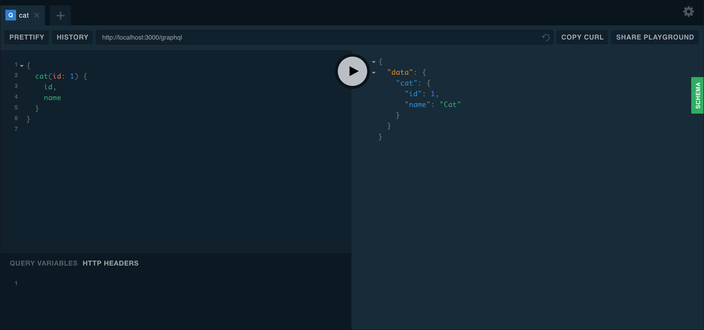

### Table of Contents

1. [Harnessing the power of TypeScript & GraphQL](#harnessing-the-power-of-typescript--graphql)
   - [Installation](#installation)
   - [Overview](#overview)
   - [Getting started with GraphQL & TypeScript](#getting-started-with-graphql--typescript)
   - [GraphQL playground](#graphql-playground)
   - [Multiple endpoints](#multiple-endpoints)
   - [Code first](#code-first)
   - [Example](#example)
   - [Schema first](#schema-first)
   - [Accessing generated schema](#accessing-generated-schema)
   - [Async configuration](#async-configuration)

## Harnessing the power of TypeScript & GraphQL

> "harness"를 검색하니 무슨 "마구" 라고 결과가 나오는데, 더 구글링을 해보니 "효율적으로 활용하다" 라는 의미가 적절할 것 같다.

[GraphQL](https://graphql.org/)은 강력한 query language이며 기존의 데이터로 이러한 쿼리를 수행하기 위한 runtime 이다. REST APIs에서 일반적으로 발견되는 많은 문제들을 해결하기 위한 우아한 접근이다. 탄생 배경의 경우, GraphQL과 REST에 관한 [이 글](https://www.apollographql.com/blog/graphql-vs-rest-5d425123e34b/)을 읽어보는 것을 제안한다. [TypeScript](https://www.typescriptlang.org/)와 결합된 GraphQL은 GraphQL query로 더 나은 type safety한 개발을 도와주고 end-to-end typing을 제공한다.

이 챕터에서는 GraphQL에 대한 기본적인 이해를 가정하고 내장된 `@nestjs/graphql` module로 작업하는 방법에 중점을 둔다. `GraphQLModule`은 [Apollo](https://www.apollographql.com/) srever로 이루어져 있다. 이러한 입증된 GraphQL package를 사용하여 NestJS와 함께 GraphQL을 사용하는 방법을 제공한다.

### Installation

프로젝트를 생성하고 필요한 package를 설치하자.

```shell
$ nest new nestjs-graphql
$ cd nestjs-graphql
$ npm i @nestjs/graphql graphql-tools graphql apollo-server-express
```

> 만약 Fastify를 사용할 거라면,<br/> `apollo-server-express` 대신 `apollo-server-fastify`를 설치하자.

### Overview

NestJS는 GraphQL application을 구축하는 두가지 방법 즉, **code first**, **schema first**를 제공한다. 당신에게 가장 적합한 것을 선택해야 한다. 이 GraphQL 섹션의 대부분의 챕터는 두 가지 main part로 나눠지는데, **code first**를 채택하거나 **schema first**를 채택해서 둘 중 하나를 따라야 한다.

**code first** 접근에서는, GraphQL schema에 해당하는 스키마를 생성하기 위해 decorator와 TypeScript classes를 사용한다. 이러한 방법은, TypeScript와 단독으로 작업하기를 선호하거나 언어 문법 간의 context switch를 피하는 경우에 유용하다.

**schema first**접근에서, 진실된 source는 GraphQL SDL(Schema Definition Language) 파일이다. SDL은 서로 다른 플랫폼 간에 언어에 구애받지 않고 스키마를 공유할 수 있는 방법이다. NestJS는 GraphQL에 기반한 TypeScript 정의(classes or interfaces 사용)를 자동으로 생성하여 boilerplate code 작성할 필요성을 줄인다.

### Getting started with GraphQL & TypeScript

package 설치가 완료되면 `GraphQLModule` 을 import해 `forRoot()` static method를 사용해 설정할 수 있다.

```ts
import { Module } from '@nestjs/common';
import { GraphQLModule } from '@nestjs/graphql';

@Module({
  imports: [GraphQLModule.forRoot({})],
})
export class AppModule {}
```

`forRoot()` 메서드는 옵션 object를 인자로 갖는다. 이 옵션들은 Apollo instance(이용 가능한 옵션들은 [이 링크](https://www.apollographql.com/docs/apollo-server/api/apollo-server.html#constructor-options-lt-ApolloServer-gt)에서 읽어 보자)에 전달된다. `playground`를 비활성화 하고 `debug` 모드를 해제하려면 아래 옵션처럼 하자.

```ts
import { Module } from '@nestjs/common';
import { GraphQLModule } from '@nestjs/graphql';

@Module({
  imports: [
    GraphQLModule.forRoot({
      debug: false,
      playground: false,
    }),
  ],
})
export class AppModule {}
```

앞서 언급했듯이, 이러한 옵션들은 `ApolloServer` 생성자로 전달될 것이다.

### GraphQL playground

playground는 GraphQL server와 동일한 URL에서 기본적으로 사용가능한 graphical, interactive, in-browser GraphQL IDE이다. playground에 접근하려면, basic한 GraphQL server가 구성되고 실행 중이어야 한다. 지금 확인하려면, [working example here](https://github.com/nestjs/nest/tree/master/sample/23-graphql-code-first)에서 install하고 build할 수 있다. 이러한 샘플 코드를 따르지 않아도, [Resolvers chapter](https://docs.nestjs.com/graphql/resolvers) 단계를 마치면 playground에 접근할 수 있다.

애플리케이션이 실행중이면, `http://localhost:3000/graphql`(host와 port는 설정에 의존한다.)을 열어볼 수 있다. 그러면 아래와 같은 GraphQL playground를 볼 수 있을 것이다.



<div style="opacity: 0.5" align="right">
    <sup>Image by: <a>https://docs.nestjs.com/assets/playground.png</a></sup>
</div>

### Multiple endpoints

`@nestjs/graphql` module의 또다른 유용한 기능은 한 번에 multiple endpoints를 제공할 수 있는 기능이다. 이를 통해 어떤 모듈이 어느 endpoint에 포함될지 결정할 수 있다. 기본적으로, `GraphQL`은 전체의 app에서 resolvers를 통해 검색한다. 이 검색을 모듈의 하위 집합으로만 제한하려면 `include` 프로퍼티를 사용하자.

```ts
GraphQLModule.forRoot({
  include: [CatsModule],
}),
```

### Code first

**code first** 접근 방식에서, decorators와 TypeScript classes를 사용하여 해당 GraphQL 스키마를 생성한다.

code first 방식을 사용하려면, `autoSchemaFile` 속성을 옵션 객체에 추가하는 것으로 시작해보자.

```ts
GraphQLModule.forRoot({
  autoSchemaFile: join(process.cwd(), 'src/schema.gql'),
}),
```

`autoSchemaFile` 속성 값은 스키마가 자동으로 생성될 path이다. 또는, on-the-fly in memory에서 생성할 수 있다. 이를 가능하게 하려면, `autoSchemaFile` 속성을 `true`로 설정하자.

```ts
GraphQLModule.forRoot({
  autoSchemaFile: true,
}),
```

기본적으로, 생성된 스키마의 types은 포함된 module에 정의된 순서대로 표시된다. 스키마를 lexicographically(사전식)으로 설정하려면, `sortSchema` 속성을 `true`로 설정하자.

```ts
GraphQLModule.forRoot({
  autoSchemaFile: join(process.cwd(), 'src/schema.gql'),
  sortSchema: true,
}),
```

### Example

작동하는 code first sample은 [여기](https://github.com/nestjs/nest/tree/master/sample/23-graphql-code-first)에서 이용가능하다.

### Schema first

schema first 방식을 사용하려면, option object에 `typePaths` 속성을 추가하자. `typePaths` 속성은 `GraphQLModule`이 GraphQL SDL 스키마 정의 파일을 찾을 수 있는 위치를 나타낸다. 이러한 파일들은 메모리에 결합된다. 따라서 이는 스키마를 여러개의 파일로 분할 하고 resolvers 근처에 위치할수 있게 한다.

```ts
GraphQLModule.forRoot({
  typePaths: ['./**/*.graphql'],
}),
```

기본적으로 GrpahQL SDL types에 해당하는 TypeScript 정의(classes and interfaces)가 있어야 한다. 해당하는 TypeScript 정의를 수동으로 생성하는 작업은 중복되고 지루하다. 그것은 하나의 자료는 한 곳에만 저장한다는 single source of truth 개념을 어긴다(SDL에서 이루어진 각각의 변화는 TypeScript 정의도 조정하도록 강요한다). 이를 해결하기 위해, `@nestjs/graphql` package는 abstract syntax tree([AST](https://en.wikipedia.org/wiki/Abstract_syntax_tree))로부터 TypeScript definitions를 **automatically generate** 할 수 있다. 이 기능을 사용하려면, `GraphQLModule`을 설정할 때 `definitions` 옵션 속성을 추가하자.

```ts
GraphQLModule.forRoot({
  typePaths: ['./**/*.graphql'],
  definitions: {
    path: join(process.cwd(), 'src/graphql.ts'),
  },
}),
```

`definitions` object의 속성인 path는 TypeScript output이 어디에 저장될지를 의미한다. 디폴트로, 모든 생성된 TypeScript types는 interfaces이다. 대신 classes로 생성하려면, `outputAs` 속성을 `'class'`로 명시하면 된다.

```ts
GraphQLModule.forRoot({
  typePaths: ['./**/*.graphql'],
  definitions: {
    path: join(process.cwd(), 'src/graphql.ts'),
    outputAs: 'class',
  },
}),
```

위 방식은 application이 시작될 때 마다 TypeScript definitions를 동적으로 생성한다. 또는 이러한 요구를 생성하기 위한 간단한 스크립트를 작성하는 것이 바람직 할지도 모른다. 예를 들어 다음 스크립트(`generate-typings.ts`)를 생성한다고 가정하자.

```ts
import { GraphQLDefinitionsFactory } from '@nestjs/graphql';
import { join } from 'path';

const definitionsFactory = new GraphQLDefinitionsFactory();
definitionsFactory.generate({
  typePaths: ['./src/**/*.graphql'],
  path: join(process.cwd(), 'src/graphql.ts'),
  outputAs: 'class',
});
```

이제 이 스크립트를 on-demand(사용자의 요구에 따라)로 실행할 수 있다.

```shell
$ ts-node generate-typings
```

> `tsc`와 같은 것을 이용하여 미리 컴파일 하고 `node`를 사용하여 실행할 수도 있다.

스크립트에 대한 watch mode를 활성화 하려면(`.graphql` file이 바뀔때 자동으로 typings), `generate()` 메서드에 `watch` 옵션을 전달하자.

```ts
definitionsFactory.generate({
  typePaths: ['./src/**/*.graphql'],
  path: join(process.cwd(), 'src/graphql.ts'),
  outputAs: 'class',
  watch: true,
});
```

모든 object type에 대해 `__typename` filed를 자동으로 추가하려면, `emitTypenameField` option을 활성화 한다.

```ts
definitionsFactory.generate({
  // ...,
  emitTypenameField: true,
});
```

인자 없이 resolvers(queries, mutations, subscriptions)를 plain field로 생성하려면, `skipResolverArgs` option을 활성화 하자.

```ts
definitionsFactory.generate({
  // ...,
  skipResolverArgs: true,
});
```

작동하는 schema first sample은 [여기](https://github.com/nestjs/nest/tree/master/sample/12-graphql-schema-first)서 이용가능하다.

### Accessing generated schema

경우에 따라(예: e2e tests) 생성된 스키마 객체에 대한 참조를 얻기를 원할 지도 모른다. e2e tests에서는, HTTP listeners를 사용하지 않고 `graphql` 객체를 사용해서 query를 실행할 수 있다.

`GraphQLSchemaHost` class를 사용하여, 생성된 스키마(code first 또는 schema first)를 접근할 수 있다.

```ts
const { schema } = app.get(GraphQLSchemaHost);
```

> 애플리케이션이 initialized된 후 `GraphQLSchemaHost#schema` getter를 호출해야 한다(`app.listen()` or `app.init()` method에 의해 `onModuleInit` 훅이 트리거된 후).

### Async configuration

모듈 옵션을 정적 대신 비동기적으로 전달해야 하는 경우 `forRootAsync()` method를 사용해라. 대부분의 동적 모듈과 마찬가지로 NestJS는 async configuration을 처리하는 몇 가지 기술을 제공한다.

한 가지 방법은 factory function을 사용하는 것이다.

```ts
GraphQLModule.forRootAsync({
  useFactory: () => ({
    typePaths: ['./**/*.graphql'],
  }),
}),
```

다른 factory providers와 마찬가지로, factory function은 [async](https://docs.nestjs.com/fundamentals/custom-providers#factory-providers-usefactory)적일 수 있으며, `inject`를 통해 의존성을 주입할 수 있다.

```ts
GraphQLModule.forRootAsync({
  imports: [ConfigModule],
  useFactory: async (configService: ConfigService) => ({
    typePaths: configService.getString('GRAPHQL_TYPE_PATHS'),
  }),
  inject: [ConfigService],
}),
```

또는 아래와 같이 factory 클래스 대신에 `GraphQLModule`을 구성할 수 있다.

```ts
GraphQLModule.forRootAsync({
  useClass: GqlConfigService,
}),
```

위의 구조는 `GraphQLModule`안에서 `GqlConfigService`를 인스턴스화하여 option object를 사용한다. 이 예에서, 아래서 보이는 것처럼 `GqlConfigService`는 `GqlOptionsFactory` interface를 구현해야 한다. `GraphQLModule`은 제공된 클래스의 인스턴스화된 객체의 `createGqlOptions()` 메서드를 호출한다.

```ts
@Injectable()
class GqlConfigService implements GqlOptionsFactory {
  createGqlOptions(): GqlModuleOptions {
    return {
      typePaths: ['./**/*.graphql'],
    };
  }
}
```

`GraphQLModule`안에서 private copy를 생성하는 대신에 존재하는 options provider를 재사용하려면, `useExisting` syntax를 사용해라.

```ts
GraphQLModule.forRootAsync({
  imports: [ConfigModule],
  useExisting: ConfigService,
}),
```

|       |                                                                         |
| :---: | :---------------------------------------------------------------------: |
| Next  | [NestJS GraphQL(2) - Resolvers](https://uchanlee.dev/NestJS/overview/2) |
| Intro |   [NestJS GraphQL(0) - Intro](https://uchanlee.dev/NestJS/GraphQL/0/)   |
