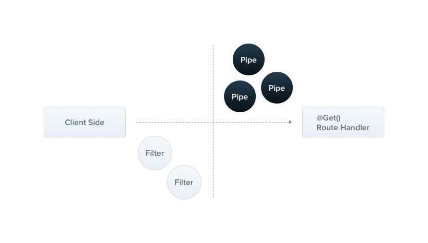

[원문](https://docs.nestjs.com/pipes)을 읽으며 정리합니다.

### Table of Contents

1. [Pipes](#pipes)
   - [Built-in pipes](#built-in-pipes)
   - [Binding pipes](#binding-pipes)
   - [Custom pipes](#custom-pipes)
   - [Schema based validation](#schema-based-validation)
   - [Object schema validation](#object-schema-validation)
   - [Binding validation pipes](#binding-validation-pipes)
   - [Class validator](#class-validator)
   - [Global scoped pipes](#global-scoped-pipes)
   - [Transformation use case](#transformation-use-case)
   - [Providing defaults](#providing-defaults)
   - [The built-in ValidationPipe](#the-built-in-validationpipe)

## Pipes

Pipe는 `@Injectable()` 데코레이터와 함께 annotate된다. Pipe는 `PipeTransform` 인터페이스를 구현한다.



<div style="opacity: 0.5" align="right">
    <sup>Image by: <a>https://docs.nestjs.com/assets/Pipe_1.png</a></sup>
</div>

Pipe는 두가지 대표적인 use case를 가진다.

- **transformation**: input의 data를 원하는 형태로(string to integer) 변환한다.
- **validation**: input의 data를 평가하고 만약 유효하다면, 변환 없이 전달한다. 그렇지 않다면, data가 부정확 할 때, 예외를 던진다.

이런 두가지 경우에, pipe는 [controller route handler](https://docs.nestjs.com/controllers#route-parameters)에서 처리되는 `arguments` 위에서 작동한다. NestJS는 pipe를 단지 메서드가 호출되기 전에 위치시킨다. 그리고 pipe는 메서드에 사용될 인자들을 전달받고 그들 위에서 작동한다. transformation 또는 validation 명령은 그 당시에 공간을 갖고, 그후 라우트 핸들러가 변환된 인자와 함께 호출된다.

NestJS는 사용할 수 있는 기본의 내장된 pipe를 몇 가지 갖고 있다. 당연히 커스텀 pipe를 만들 수도 있다. 이번 챕터에서는, 내장된 pipe들을 소개할 것이고, 어떻게 그들을 route handler에 바인딩 하는지 보여준다. 그런 다음 처음부터 커스텀 pipe를 만드는 법도 알려준다.

> pipe는 exception 구역에서 돌아간다. 이 뜻은, pipe가 예외를 throw할때, exception layer에서 처리된다(global 예외 필터 그리고 현재 context에 적용된 [exceptions filters](https://docs.nestjs.com/exception-filters)). 위를 감안하면, 예외가 pipe안에서 throw될때, 어떤 컨트롤러 메서드도 그 이후에 실행되지 않는다는 점을 분명히 해야 한다. 이는 system 영역의 외부 소스로부터 애플리케이션 안으로 들어오는 유효한 데이터를 위한 좋은 모범 사례임을 보여준다.

### Built-in pipes

NestJS는 기본적으로 6개의 pipe를 제공한다.

- `ValidationPipe`
- `ParseIntPipe`
- `ParseBoolPipe`
- `ParseArrayPipe`
- `ParseUUIDPipe`
- `DefaultValuePipe`

이들은 `@nestjs/common` 패키지에서 export 한다.

자 빠르게 `ParseInePipe`를 살펴보자. pipe가 JavaScript integer로 변환된 메서드 핸들러 파라미터를 보장하고(실패한다면 예외를 던짐), 이는 **transformation** use case의 예제이다. 이 챕터에서 나중에, 우리는 `ParseIntPipe`를 위한 간단한 커스텀 구현을 볼 것이다. 아래의 예제 기술은 다른 내장된 변형 pipe(`ParseBoolPipe`, `ParseArrayPipe`, `ParseUUIDPipe` 등 이번 챕터에서 `Parse*`로 사용할 pipe들)에도 적용된다.

### Binding pipes

pipe를 사용하기 위해, 적절한 맥랙으로 pipe 클래스의 인스턴스를 바인딩 할 필요가 있다. 예제 `ParseIntPipe` 에서, 우리는 특정 라우트 핸들러 메서드와 함께 pipe가 연결되길 원하고, 메서드가 호출되기 전에 실행되는가를 확인한다. 우리는 다음과 같은 구조로 메서드 파라미터 레벨에서 pipe를 바인딩하는 것으로 동작 할 것이다.

```ts
@Get(':id')
async findOne(@Param('id', ParseIntPipe) id: number) {
  return this.catsService.findOne(id);
}
```

이것은 두가지 상태중 하나는 true임을 보장한다. `findOne()` 메서드 안에서 받는 파라미터가 숫자이거나, 라우트 핸들러가 호출되기전 던져진 예외이다.

예를들어, 다음과 같이 라우트가 호출된다고 하자.

```
GET localhost:3000/abc
```

NestJS는 아래와 같이 예외를 던질 것이다.

```
{
  "statusCode": 400,
  "message": "Validation failed (numeric string is expected)",
  "error": "Bad Request"
}
```

이 예외는 실행으로부터 `findOne()` 메서드의 본문을 막을 것이다.

위 예제에서, `ParseIntPipe` 클래스를 전달했다. 인스턴스가 아니다. 인스턴스화의 책임을 프레임워크에 넘기고 의존성 주입을 가능하게 한다. pipe와 guard처럼, 우리는 인스턴스 전달을 대신할 수 있다. 인스턴스 전달은 option에 따른 내장된 pipe의 행동을 커스터마이징 하고 싶다면 유용할 수 있다.

```ts
@Get(':id')
async findOne(
  @Param('id', new ParseIntPipe({ errorHttpStatusCode: HttpStatus.NOT_ACCEPTABLE }))
  id: number,
) {
  return this.catsService.findOne(id);
}
```

다른 transformation pipe를(모든 `Parse*` pipes) 바인딩할때도 비슷하게 동작한다. 이러한 pipe들은 모두 라우트 파라미터 검증, 쿼리 스트링 파라미터, request body values의 문법에서 동작한다.

query string parameter의 예제다.

```ts
@Get()
async findOne(@Query('id', ParseIntPipe) id: number) {
  return this.catsService.findOne(id);
}
```

아래는 `ParseUUIDPipe`를 사용해 string parameter를 분석하고 UUID인지 검증하는 예제이다.

```ts
@Get(':uuid')
async findOne(@Param('uuid', new ParseUUIDPipe()) uuid: string) {
  return this.catsService.findOne(uuid);
}
```

> `ParseUUIDPipe()`를 사용할때 명시된 버전을 요구한다면 pipe options에 3, 4, 5를 전달할 수 있다.

위 예제에서 본것처럼 내장된 `Parse*` 종류의 pipe 바인딩을 살펴봤다. validation pipe를 바인딩 하는것은 약간 다르다. 다음 섹션에서 설명할 것이다.

> 또한, [Validation techniques](https://docs.nestjs.com/techniques/validation)에서 validation pipes의 아주많은 예를 보자.

### Custom pipes

언급했듯이, 커스텀 파이프를 구성할 수 있다. 커스텀 pipe를 만들어 보자.

간단한 `ValidationPipe`로 시작해보자. 처음에, 단순히 입력값을 바로 반환하는 마치 항등 함수 처럼 동작하는 걸 가진다.

```ts
// validation.pipe.ts
import { PipeTransform, Injectable, ArgumentMetadata } from '@nestjs/common';

@Injectable()
export class ValidationPipe implements PipeTransform {
  transform(value: any, metadata: ArgumentMetadata) {
    return value;
  }
}
```

> `PipeTransform<T, R>`은 제네릭 인터페이스 이며 구현되어야 한다. input `value`를 나타내기 위해 `T`를 사용하고, `R`은 `transform()` 메서드의 리턴 타입을 나타낸다.

모든 pipe는 `transform()` 메서드를 구현해야 한다. 이 메서드는 두가지 파라미터를 가진다.

- `value`
- `metadata`

`value` 파라미터는 현재 실행중인 메서드 인자이다(라우트 핸들러 메서드에 전달되기 전에). 그리고 `metadata`는 현재 실행중인 메서드 인자의 metadata이다. metadata 객체는 이러한 속성을 가진다.

```ts
export interface ArgumentMetadata {
  type: 'body' | 'query' | 'param' | 'custom';
  metatype?: Type<unknown>;
  data?: string;
}
```

이러한 속성들은 현재 실행중인 인자를 설명한다.

<table>
  <thead>
    <tr>
      <th class="left"></th>
      <th class="left"></th>
    </tr>
  </thead>
  <tbody>
    <tr>
      <td class="left">type</td>
      <td class="left">인자가 body, <code class="language-text">@Body()</code> 인지 query, <code class="language-text">@Query()</code> 인지
      param, <code class="language-text">@Param()</code> 인지 또는 커스텀 파라미터 인지(<a href="https://docs.nestjs.com/custom-decorators">자세한 내용</a>) 나타낸다.
      </td>
    </tr>
    <tr>
      <td class="left">metatype</td>
      <td class="left">인자의 metatype을 제공한다. 예를 들면, <code class="language-text">String</code>
      만약 라우트 핸들러 메서드에 type 선언을 빠트리거나 vanilla JavaScript를 사용한다면 그 값은 <code class="language-text">undefined</code> 이다.
      </td>
    </tr>
    <tr>
      <td class="left">data</td>
      <td class="left">데코레이터에 전달된 문자열이다. 예를 들면 <code class="language-text">@Body('string')</code>.
      만약 데코레이터를 비워 놨다면 <code class="language-text">undefined</code>이다.
      </td>
    </tr>
</tbody>
</table>

> TypeScript 인터페이스는 트랜스파일 과정에서 사라진다. 그러므로, 메서드 파라미터의 타입이 클래스 대신 인터페이스로 알려져 있다면 `metatype` 값은 `Object`가 될 것이다.

### Schema based validation

조금 유용한 validation pipe를 만들어 보자. `CatsController`의 `create()` 메서드를 자세히 살펴보자. 우리는 service 메서드가 실행되기 전에 post body object의 검증을 하고 싶다.

```ts
@Post()
async create(@Body() createCatDto: CreateCatDto) {
  this.catsService.create(createCatDto);
}
```

`createCatDto` 파라미터에 집중하자. 이것의 타입은 `CreateDto` 이다.

```ts
// create-cat.dto.ts
export class CreateCatDto {
  name: string;
  age: number;
  breed: string;
}
```

우리는 create method에 들어오는 요청이 유효한 body임이 보장되기를 원한다. 그래서 `createCatDto` 객체의 3가지 속성들을 검증해야 한다. 이를 라우트 핸들러 메서드 안에서 수행할 수 있따. 하지만 이는 **single responsibility rule**에 위반한다.

다른 접근 방식은 **validator class**를 만들고 거기서 작업하는 것일 수 있다. 이것은 각 메서드의 시작부분에서 validator를 호출해야한다는 단점이 있다.

그렇다면 validation middleware를 만드는 것은 어떨까? 이것은 잘 작동할수 있다. 그러나 불행하게도 전체의 애플리케이션을 가로질러 모든 context를 가로질러 사용될 수 있는 **generic middleware**를 만드는 것은 불가능하다. 이러한 이유로 미들웨어는 파라미터가 호출될 핸들러를 포함한 **execution context(실행 컨텍스트)**를 알지 못한다.

정확히 pipe가 설계된 use case이다. 자 이제 validation pipe를 개선해보자.

### Object schema validation

깔끔하게([DRY, way](https://en.wikipedia.org/wiki/Don%27t_repeat_yourself)) 객체를 검증하는 방법은 여러가지가 이용가능 하다. 한가지 흔한 방식은 **schema-based** 검증을 사용하는 것이다. 이 방식을 사용해보자.

[Joi](https://github.com/sideway/joi) 라이브러리는 가독성이 좋은 API와 함께 복잡하지 않게 스키마 생성을 도와준다. Joi 기반의 스키마를 사용한 validation pipe를 만들어 보자.

먼저 다음 패키지 설치를 필요로 한다.

```shell
$ npm install --save joi
$ npm install --save-dev @types/joi
```

아래의 샘플 코드에서, `contructor` 인자를 통해 스키마를 갖는 simpel class를 만든다. 그 다음 제공된 스키마에 대해 들어오는 인자들을 검증하는 `schema.validate()` 메서드를 적용한다. 앞서 말했듯이, **validation pipe**는 변경되지 않은 값을 리턴하거나 예외를 던진다.

다음 섹션에서, `UsePipes()` 데코레이터를 사용해서 어떻게 컨트롤러 메서드에 적절한 스키마를 공급하는지 볼 것이다. 이렇게 설정하면 context를 가로질러 재사용 가능한 pipe를 만들 수 있다.

```ts
import {
  PipeTransform,
  Injectable,
  ArgumentMetadata,
  BadRequestException,
} from '@nestjs/common';
import { ObjectSchema } from 'joi';

@Injectable()
export class JoiValidationPipe implements PipeTransform {
  constructor(private schema: ObjectSchema) {}

  transform(value: any, metadata: ArgumentMetadata) {
    const { error } = this.schema.validate(value);
    if (error) {
      throw new BadRequestException('Validation failed');
    }
    return value;
  }
}
```

### Binding validation pipes

앞서, transformation pipes를 바인딩 하는 방법은 봤다.

validation pipes를 바인딩 하는것은 매우 간단하다.

이 경우에서, method call level에서 바인딩 할 수 있다. 우리의 현재 예제에서, `JoiValidationPipe`를 사용하려면 다음을 따라야 한다.

1. `JoiValidationPipe`의 인스턴스를 생성한다.
2. pipe의 생성자에 context-specific Joi schema를 전달한다.
3. 메서드에 pipe를 바인딩한다.

아래와 같이 `@UsePipes()` 데코레이터를 사용하면 된다.

```ts
@Post()
@UsePipes(new JoiValidationPipe(createCatSchema))
async create(@Body() createCatDto: CreateCatDto) {
  this.catsService.create(createCatDto);
}
```

> `@UsePipes()` 데코레이터는 `@nestjs/common` 패키지로부터 import 되었다.

### Class validator

> 이 섹션에서의 기술은 TypeScript를 요구한다. 만약 너의 app이 vanilla JavaScript로 작성되었다면 이용할 수 없다.

검증 기술의 대체 구현을 살펴보자.

NestJS는 [class-validator](https://github.com/typestack/class-validator) 라이브러리와 잘 동작한다. 이 강력한 라이브러리는 decorator 기반의 validation을 사용 가능하게 해준다. Decorator-based validation은 극도로 강력하다. 특히 NestJS의 **Pipe**의 능력과 결합되었을때 실행중인 속성의 `metatype`을 접근할 수 있기 때문이다. 시작하기 전에, 다음 패키지를 요구한다.

```shell
$ npm i --save class-validator class-transformer
```

설치가 완료되면, `CreateCatDto` 클래스에 몇가지 데코레이터를 추가할 수 있다. 여기 이 기술의 중요한 이점이 있다. `CreateCatDto` 클래스는 별도의 검증 클래스를 만들지 않고 Post body object의 진실된 단일 코드로 남아있다.

```ts
// create-cat.dto.ts
import { IsString, IsInt } from 'class-validator';

export class CreateCatDto {
  @IsString()
  name: string;

  @IsInt()
  age: number;

  @IsString()
  breed: string;
}
```

> class-validator decorator에 대한 자세한 사용법은 [이 링크](https://github.com/typestack/class-validator#usage)를 읽어보자.

이제 이러한 어노테이션을 사용하는 `ValidationPipe` 클래스를 만들 수 있다.

```ts
// validation.pipe.ts
import {
  PipeTransform,
  Injectable,
  ArgumentMetadata,
  BadRequestException,
} from '@nestjs/common';
import { validate } from 'class-validator';
import { plainToClass } from 'class-transformer';

@Injectable()
export class ValidationPipe implements PipeTransform<any> {
  async transform(value: any, { metatype }: ArgumentMetadata) {
    if (!metatype || !this.toValidate(metatype)) {
      return value;
    }
    const object = plainToClass(metatype, value);
    const errors = await validate(object);
    if (errors.length > 0) {
      throw new BadRequestException('Validation failed');
    }
    return value;
  }

  private toValidate(metatype: Function): boolean {
    const types: Function[] = [String, Boolean, Number, Array, Object];
    return !types.includes(metatype);
  }
}
```

> 위에서 [class-transformer](https://github.com/typestack/class-transformer) 라이브러리를 사용해왔다. 이는 같은 저자에 의해 만들어졌다(class-validator). 따라서 둘은 매우 잘 작동된다.

코드를 살펴보자. 먼저, `transform()` 메서드는 `async`가 붙은것을 주의하자. 이는 NestJS가 synchronous와 **asynchronous** 둘다 지원하기 때문에 가능하다. 이 메서드를 `async`로 만들었다. 왜냐하면 class-validator 의 몇가지 validation들이 [async가 될 수](https://github.com/typestack/class-validator#custom-validation-classes) 있기 때문이다.

다음은 metatype field를 `metatype`(`ArgumentMetadata`의 멤버) 파라미터에 destructuring해서 사용했다. 이것은 단지 단축 문법이다.

다음은, helper function `toValidate()` 이다. 그것은 현재 처리중인 인자가 네이티브 JavaScript 타입일때 유효성 검사 단계를 생략하는 역할을 한다(이러한 인자들은 validation decorators를 부착할수 없으므로 유효성 검증 단계를 통해 실행될 이유가 없다.).

다음은, class-transformer function인 `plainToClass()`를 validation을 적용할 수 있도록 하기 위해 typed object를 plain JavaScript argument objet로 변환하기 위하여 사용한다. 그 이유는 네트워크 요청에서 역직렬화 할때 post body object는 **type information이 없기** 때문이다(Express와 같은 기본 플랫폼은 이러한 방법으로 작동한다.). Class-validator는 DTO를 정의한 validation decorator를 사용해야 하므로, 들어오는 body를 vanilla object가 아닌 적절한 decorated object로 취급하기 위해 이 변환을 할 필요가 있다.

마지막으로, 앞에서 언급했듯이, **validation pipe**는 바뀌지 않은 값을 리턴하거나 예외를 발생시킨다.

마지막 스템은 `ValidationPipe`를 바인딩 하는것이다. Pipe들은 parameter-scoped, controller-scoped, global-scoped가 될 수 있다. 앞서 Joi 기반의 validation pipe에서처럼 method level에서 pipe를 바인딩 하는 예제를 봤다. 아래의 예제에서는 post body를 검증하기위해 호출되도록 라우트 핸들러 `@Body()` 데코레이터에 pipe의 인스턴스를 바인딩할 것이다.

```ts
// cats.controller.ts
@Post()
async create(
  @Body(new ValidationPipe()) createCatDto: CreateCatDto,
) {
  this.catsService.create(createCatDto);
}
```

parameter-scoped pipes는 validation logic을 오직 명시된 파라미터 하나에만 관련시킬 때 유용하다.

### Global scoped pipes

`ValidationPipe`가 generic이 가능하게 생성되었기 때문에, 우리는 **global-scoped** pipe를 설정해 전체 유틸리티를 실현할 수 있다.

```ts
// main.ts
async function bootstrap() {
  const app = await NestFactory.create(AppModule);
  app.useGlobalPipes(new ValidationPipe());
  await app.listen(3000);
}
bootstrap();
```

> [hybrid apps](https://docs.nestjs.com/faq/hybrid-application)의 경우엔 `useGlobalPipes()` 메서드가 gateway와 micro service의 pipe를 설정하지 않는다. 표준(non-hybrid) microservice app의 경우 `useGlobalPipes()`는 전체적으로 pipe를 마운트 한다.

dependency injection 측면에서 메모하자, 위의 예시와 같이 `useGlobalPipes()`와 함께 모듈 밖에서 등록된 global pipes는 모듈의 context 밖에서 바인딩 되었기 때문에 의존성 주입을 할 수 없다. 이러한 문제를 해결하기 위해, 아래와 같이 따르면 global pipe를 **어느 모듈로부터 직접** 설정할 수 있다.

```ts
// app.module.ts
import { Module } from '@nestjs/common';
import { APP_PIPE } from '@nestjs/core';

@Module({
  providers: [
    {
      provide: APP_PIPE,
      useClass: ValidationPipe,
    },
  ],
})
export class AppModule {}
```

> 이 방식을 사용하여 pipe에 의존성 주입을 수행한다면, 이 구조가 사용되는 모듈에 관계 없이 pipe가 항상 global이라는 사실을 유의하자. 이 작업은 어디서 수행되어야 할까? pipe가 정의된 모듈을 선택해라(위 예제에서 `ValidationPipe`). 또한, `useClass`는 커스텀 provider를 등록하는 유일한 방법은 아니다. [이 링크](https://docs.nestjs.com/fundamentals/custom-providers)에서 더 살펴보자.

### Transformation use case

validation이 커스텀 pipe의 유일한 use case는 아니다. 이 챔터의 시작에서, pipe는 우리가 input data를 원하는 형태로 포매팅 할 수 있다고 언급했다. 이는 `transform` function에서 반환된 값이 완벽하게 인자의 이전 값을 오버라이드 하기 때문에 가능하다.

언제 이게 유용할까? 때때로 클라이언트로 부터 전달된 데이터가 약간의 변화를 겪어야 한다는 점을 고려하자. 예를 들어 string 을 integer로 변환한다(이전에, 라우트 핸들러 메서드에 의해 적절히 처리될 수 있다.). 뿐만 아니라, 요구하는 데이터 필드가 missing 될 지도 모른다. 그리고 디폴트 값을 적용하기를 원한다. **Transformation pipes**는 client request와 request handler 사이에서 끼어드는 processing function에 의해 이러한 기능들을 수행할 수 있다.

여기 stirng을 integer value로 parsing하는 책임을 지는 간단한 `ParseIntPipe`가 있다(위에서 언급했듯이, NestJS는 세련되고 내장된 `ParseIntPipe`를 가진다. 아래 간단한 커스텀 transformation pipe의 예제를 포함한다.).

```ts
// parse-int.pipe.ts
import {
  PipeTransform,
  Injectable,
  ArgumentMetadata,
  BadRequestException,
} from '@nestjs/common';

@Injectable()
export class ParseIntPipe implements PipeTransform<string, number> {
  transform(value: string, metadata: ArgumentMetadata): number {
    const val = parseInt(value, 10);
    if (isNaN(val)) {
      throw new BadRequestException('Validation failed');
    }
    return val;
  }
}
```

아래 처럼 선택된 param에 pipe를 bind 할 수 있다.

```ts
@Get(':id')
async findOne(@Param('id', new ParseIntPipe()) id) {
  return this.catsService.findOne(id);
}
```

또다른 유용한 transformation case로 request에 들어온 id를 사용해 database의 **존재하는 user** entity를 갖기를 원한다.

```ts
@Get(':id')
findOne(@Param('id', UserByIdPipe) userEntity: UserEntity) {
  return userEntity;
}
```

이 pipe의 구현은 독자에게 맡긴다. 그러나 모든 transformation pipe와 마찬가지로, input value(`id`)를 받고 `UserEntity` object를 output value로 리턴한다. 이는 handler에서 공통 pipe로 boilerplate code를 추상화 하여 코드를 더욱 선언적(declarative)이고 [DRY](https://en.wikipedia.org/wiki/Don%27t_repeat_yourself)하게 만들 수 있다.

### Providing defaults

`Parse*` pipe들은 파라미터의 값이 정의되기를 기대한다. 이들은 `null` or `undefined` values를 받을 때 예외를 발생시킨다. endpoint가 누락된 querystring parameter values를 처리할 수 있도록 하려면, `Parse*` pipe가 이 값에서 작동하기 전에 주입할 default value를 제공해야 한다. `DefaultValuePipe`는 이런 목적을 제공한다. 아래 보이는 것처럼, `Parse*` pipe 앞에 붙어있는 `@Query()` 데코레이터에 `DefaultValuePipe`를 인스턴스화 시킨다.

```ts
@Get()
async findAll(
  @Query('activeOnly', new DefaultValuePipe(false), ParseBoolPipe) activeOnly: boolean,
  @Query('page', new DefaultValuePipe(0), ParseIntPipe) page: number,
) {
  return this.catsService.findAll({ activeOnly, page });
}
```

### The built-in ValidationPipe

다시한번 remind 하면, NestJS에서 out-of-the-box(기본)으로 `ValidationPipe`를 제공하기 때문에 generic validation pipe를 제작할 필요가 없다. 내장된 `ValidationPipe`는 이 챕터에서
작성한 샘플보다 더 많은 옵션을 제공한다. 이 샘플은 커스텀 pipe의 메커니즘을 설명하기 위해 기본적으로 유지된다. 모든 자세한 사항과 예제를 [이 링크](https://docs.nestjs.com/techniques/validation)에서 확인할 수 있다.

|       |                                                                      |
| :---: | :------------------------------------------------------------------: |
| Next  | [NestJS OVERVIEW(8) - Guard](https://uchanlee.dev/NestJS/overview/8) |
| Intro | [NestJS OVERVIEW(0) - Intro](https://uchanlee.dev/NestJS/overview/0) |
