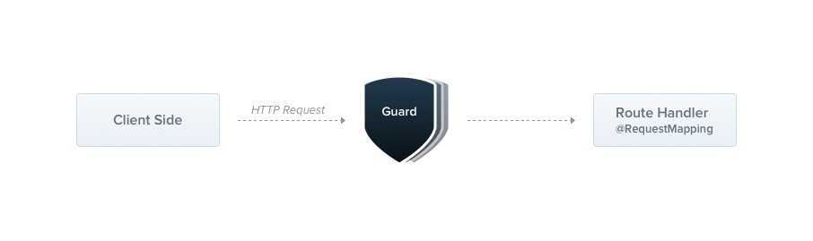

[원문](https://docs.nestjs.com/guards)을 읽으며 정리합니다.

### Table of Contents

1. [Guards](#guards)
   - [Authorization guard](#authorization-guard)
   - [Execution context](#execution-context)
   - [Role-based authentication](#role-based-authentication)
   - [Binding guards](#binding-guards)
   - [Setting roles per handler](#setting-roles-per-handler)
   - [Putting it all together](#putting-it-all-together)

## Guards

Guard는 `@Injectable()` 데코레이터와 함께 annotate 된다. Guard는 `CanActivate` 인터페이스를 구현해야 한다.



<div style="opacity: 0.5" align="right">
    <sup>Image by: <a>https://docs.nestjs.com/assets/Guards_1.png</a></sup>
</div>

Guards는 **단일 책임**을 갖는다. 이들은 주어진 요청이 run-time에 존재하는 특정 조건에 따라 라우트 핸들러에 의해 처리될 수 있는지 아닌지 밝혀낸다. 이는 종종 **authorization**이라고 불린다. Authorization은 보통 전통적인 express application에서 [middleware](https://docs.nestjs.com/middleware)에 의해 처리된다. 미들웨어는 authentication을 위한 좋은 선택이다. token validation과 attaching properties같은 `request` object는 특정 라우트 context와 metadata에 강력하게 연결되지 않기 때문이다.

그러나 미들웨어는, 원래 바보같은 짓이다. `next()` function이 호출된 후에 어느 handler가 실행될 지를 알지 못한다. 반면에, **Guards**는 `ExecutionContext` 인스턴스에 접근 할 수 있다. 그러므로 다음에 무슨 일이 실행될지 정확하게 알 수 있다. exception filters, pipes, interceptors는 request/response cycle의 정확한 지점에 processing logic을 덧붙이고 선언적으로 할 수 있게, 이렇게 디자인 되었다. 이는 너의 코드를 DRY하고 declarative하게 유지하는데 도움을 준다.

> Guards는 middleware 후에 실행된다. 단 interceptor와 pipe보단 전에.

### Authorization guard

앞에서 언급했듯이, 특정 라우트는 오직 caller가 권한을 가져야만 이용가능해야 하기 때문에 **authorization**은 Guard로써 훌륭한 use case이다. 이제 만들어볼 `AuthGuard`는 인증딘 사용자를 보장하므로 request heaaders에 token이 첨부된다. 토큰을 추출하고 검증하여 request가 진행할 수 있는지 아닌지 여부를 밝혀낸다.

```ts
// auth.guard.ts
import { Injectable, CanActivate, ExecutionContext } from '@nestjs/common';
import { Observable } from 'rxjs';

@Injectable()
export class AuthGuard implements CanActivate {
  canActivate(
    context: ExecutionContext
  ): boolean | Promise<boolean> | Observable<boolean> {
    const request = context.switchToHttp().getRequest();
    return validateRequest(request);
  }
}
```

> 만약 애플리케이션에서 인증 메커니즘을 구현하는 실제 예제를 찾는다면 [이 챕터](https://docs.nestjs.com/security/authentication)를 방문하자. 비슷하게, 세련된 authorization example은 [이 페이지](https://docs.nestjs.com/security/authorization)를 확인하자.

`validateRequest()` function안에 로직은 간단하거나 세련되게 니즈에 따라 이루어질 수 있다. 이 예제의 핵심 포인트는 어떻게 gurads가 request/response cycle에 적합한지 보여주는 것 이다.

모든 가드는 `canActivate()` function은 구현해야 한다. 이 함수는 boolean 값을 리턴한다. 이는 현재 request가 허용될지 아닐지를 나타낸다. 또, 비동기와 동기로(via a `Promise` or `Observable`) response를 return할 수 있다. NestJS는 다음과 같은 행동을 취하기 위해 return value를 사용한다.

- 만약 `true`이면, request는 처리될 것이다.
- 만약 `false`이면, NestJS는 request를 거부할 것이다.

### Execution context

`canActivate()` function은 하나의 argument를 갖는다. 바로 `ExecutionContext` 인스턴스이다. `ExecutionContext`는 `ArgumentsHost`를 상속한다. 이전의 예외 필터 챕터에서 사용한 `Request` object로부터 참조를 얻을수 있는 `ArgumentsHost`를 봤었다. 이 주제에 대한 더 많은 내용은 [exception filters](https://docs.nestjs.com/exception-filters#arguments-host) chapter의 **Arguments host** section으로 돌아가 확인할 수 있다.

`ArgumentsHost`, `ExecutionContext`를 상속함으로써, 현재 실행 프로세스에 대한 추가적인 세부 사항을 제공하는 몇가지 새로운 helper method를 추가한다. 이러한 세부 정보는 광범위한 컨트롤러, methods, execution contexts로부터 작동할 수 있는 generic guards를 구축하는데 도움이 될 수 있다. `ExecutionContext`에 대한 자세한 내용은 [이 링크](https://docs.nestjs.com/fundamentals/execution-context)를 참고하자.

### Role-based authentication

특정 역할에 해당하는 유저만 권한을 허락하는 guard를 만들어 보자. 기본적인 guard template로 시작할 것이다. 그리고 다음 섹션에서 만들 것이다. 지금은, 모든 요청을 처리되기에 허용한다.

```ts
// roles.guard.ts
import { Injectable, CanActivate, ExecutionContext } from '@nestjs/common';
import { Observable } from 'rxjs';

@Injectable()
export class RolesGuard implements CanActivate {
  canActivate(
    context: ExecutionContext
  ): boolean | Promise<boolean> | Observable<boolean> {
    return true;
  }
}
```

### Binding guards

pipe, exception filters와 마찬가지로 guards는 **controller-scoped**, method-scoped, global-scoped로 쓰일 수 있다. 아래처럼, `@UseGuards()` 데코레이터를 사용해서 controller-scoped guard를 설정해 보자. 이 데코레이터는 하나의 인자를 갖을 수 있고, 컴마로 구분하여 리스트를 받을 수 도 있다. 한번의 선언으로 guards의 설정을 적절하고 쉽게 적용한다.

```ts
@Controller('cats')
@UseGuards(RolesGuard)
export class CatsController {}
```

> `@UseGuards()` 데코레이터는 `@nestjs/common` 패키지로부터 import 되었다.

위에서, 인스턴스대신 `RoulesGuard` 타입을 전달했다. 프레임워크에 인스턴스화 책임을 떠넘기고 의존성 주입을 가능하게 한다. pipe와 exception filters와 마찬가지로 in-place instance(내부에서 생성한 인스턴스) 또한 pass 할 수 있다.

```ts
@Controller('cats')
@UseGuards(new RolesGuard())
export class CatsController {}
```

위의 구조는 이 컨토럴러가 선언한 모든 핸들러에 guard를 부착한다. 만약 guard가 single method에만 적용되기를 바란다면, `@UseGuards()` 데코레이터를 **method level**에서 적용하면 된다.

global guard를 set하기 위해서는, NestJS application instance의 `useGlobalGuards()` 메서드를 사용한다.

```ts
const app = await NestFactory.create(AppModule);
app.useGlobalGuards(new RolesGuard());
```

> hybrid apps의 경우엔 `useGlobalGuards()` 메서드는 디폴트로 gateways and micro services를 위한 guards를 set하지 않는다(이 행동을 바꾸기 위해서는 [Hybrid application](https://docs.nestjs.com/faq/hybrid-application)를 보자.). "standard"(non-hybrid) microservice apps는 `useGlobalGuards()`가 global로 마운트한다.

Global guards는 전체의 애플리케이션을 건너서 사용된다. 의존성 주입 관점에서, global guards는 위 예제와 같이 `useGlobalGuards()`로 모듈 밖에서 등록되면, 모듈의 context 밖에서 수행되므로 의존성 주입을 할 수 없다. 이 이슈를 해결하기 위해, guard를 아래와 같은 구조로 사용해서 모듈로부터 직접 설정할 수 있다.

```ts
// app.module.ts
import { Module } from '@nestjs/common';
import { APP_GUARD } from '@nestjs/core';

@Module({
  providers: [
    {
      provide: APP_GUARD,
      useClass: RolesGuard,
    },
  ],
})
export class AppModule {}
```

> guard를 위한 dependency injection을 수행하기 위해 이러한 접근을 사용할때 이 구조가 사용되는 모듈에 개의치 않고 guard는 global임을 주의하자. 이것은 어디서 수행되어야 할까? 위 예제에서 `RolesGuard`가 정의된 곳의 모듈을 선택하자. 또한, `useClass`만이 커스텀 프로바이더에 등록을 하는 유일한 방법은 아니다. [이 링크](https://docs.nestjs.com/fundamentals/custom-providers)에서 더 알아보자.

### Setting roles per handler

`RolesGuard`는 작동한다. 그러나, 아직 매우 똑똑하지 않다. 가장 중요한 guard feature인 [execution context](https://docs.nestjs.com/fundamentals/execution-context)의 장점을 활용하지 못하고 있다. 아직 역할에 대해 알지 못하고 어느 역할이 각 핸들러에 허용될지 모른다. 예제에서 `CatsController`는 라우트별로 다른 권한을 가질 수 있다. 몇은 오직 어드민 유저만 이용가능하고 다른건 모든 사용자에게 공개되어야 할 지도 모른다. 어떻게 유연하고 재사용가능한 방법으로 라우트에 역할을 매칭할 수 있을까?

여기서 **custom metadata**가 사용된다([여기서](https://docs.nestjs.com/fundamentals/execution-context#reflection-and-metadata) 더 알아보자.). NestJS는 `@SetMetadata()` 데코레이터를 통해서 라우트 핸들러에 **metadata**를 덧붙이는 능력을 제공한다. 이 metadata는 우리가 빠트린 `role` data(smart guard가 판단을 하기위해 필요한)를 공급한다. `@SetMetadata()`를 사용해보자.

```ts
// cats.controller.ts
@Post()
@SetMetadata('roles', ['admin'])
async create(@Body() createCatDto: CreateCatDto) {
  this.catsService.create(createCatDto);
}
```

> `@SetMetadata()` 데코레이터는 `@nestjs/common` 패키지에 있다.

위와 같은 구조를 사용하여, `roles` 메타데이터(`roles`가 key이고 `['admin']`은 특정 값)를 부착했다. 이렇게 작동할때, 라우트에 직접 `@SetMetadata()`를 사용하는 것은 좋은 사례가 아니다. 대신에, 아래처럼 개인의 decorators를 만들어보자.

```ts
// roles.decorator.ts
import { SetMetadata } from '@nestjs/common';

export const Roles = (...roles: string[]) => SetMetadata('roles', roles);
```

이러한 접근은 더욱 깔끔하고 가독성을 좋게 한다. 그리고 강력한 종류다. 이제 커스텀 `@Roles()` 데코레이터를 가졌다. `create()` 메서드에 데코레이터를 사용할 수 있다.

```ts
// cats.controller.ts
@Post()
@Roles('admin')
async create(@Body() createCatDto: CreateCatDto) {
  this.catsService.create(createCatDto);
}
```

### Putting it all together

이제 돌아가서 `RolesGuard`와 함께 묶겠다. 현재, 간단하게 모든 경우에 `true`를 리턴한다(모든 요청의 처리가 허용된다.). 처리중인 라우트에 필요한 실제 role과 현재 user에 할당된 role을 비교하여 return value를 설정하기를 원한다. route의 role(custom metadata)을 접근하기 위해 `@nestjs/core` 패키지로부터 기본 제공되는 `Reflector` 헬퍼 클래스를 사용할 것이다.

```ts
// roles.guard.ts
import { Injectable, CanActivate, ExecutionContext } from '@nestjs/common';
import { Reflector } from '@nestjs/core';

@Injectable()
export class RolesGuard implements CanActivate {
  constructor(private reflector: Reflector) {}

  canActivate(context: ExecutionContext): boolean {
    const roles = this.reflector.get<string[]>('roles', context.getHandler());
    if (!roles) {
      return true;
    }
    const request = context.switchToHttp().getRequest();
    const user = request.user;
    return matchRoles(roles, user.roles);
  }
}
```

> node.js world에서, 권한 있는 사용자를 `request` object에 연결하는 것이 일반적이다. 그러므로, 위 샘플코드에서, `request.user`에 사용자 인스턴스와 허용되는 role이 포함되어 있다고 가정한다. 너의 앱에서, 커스텀<br /> `authentication guard`(or middleware)에서 연결을 만들 수 있을것이다. 이 주제의 내용은 [이 챕터](https://docs.nestjs.com/security/authentication)에서 확인하자.

> 로직 안에 `matchRoles()` function은 간단하거나 니즈에 따라 세련되게 구성될 수 있따. 이 예제의 핵심 포인트는 request/response cycle에 어떻게 guards를 적용 하는지 보여주는 것이다.

context-sensitive적인 방식으로 `Reflector`를 활용하는 자세한 방법은 **Execution context** 챕터에서 [Reflection and metadata](https://docs.nestjs.com/fundamentals/execution-context#reflection-and-metadata) section을 참조하자.

권한이 부족한 사용자가 엔드포인트를 요청하면 NestJS는 자동으로 다음 response를 따른다.

```json
{
  "statusCode": 403,
  "message": "Forbidden resource",
  "error": "Forbidden"
}
```

guard가 `false`를 리턴하면 뒤에서 암묵적으로, 프레임워크가 `ForbiddenException` 예외를 발생시킨다. 만약 다른 에러 응답을 return하고 싶다면 너만의 명시된 예외를 발생하면 된다.

```ts
throw new UnauthorizedException();
```

guard에 이해 발생된 예외는 [exceptions layer](https://docs.nestjs.com/exception-filters)에 의해 처리될 것이다(현재 context에 적용된 global exceptions filter, 모든 예외 필터).

> authorization을 구현하는 진짜 예제를 보고싶다면 [이 챕터](https://docs.nestjs.com/security/authorization)를 확인하자.

|       |                                                                            |
| :---: | :------------------------------------------------------------------------: |
| Next  | [NestJS OVERVIEW(9) - Interceptor](https://uchanlee.dev/NestJS/overview/9) |
| Intro |    [NestJS OVERVIEW(0) - Intro](https://uchanlee.dev/NestJS/overview/0)    |
