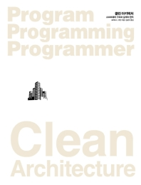

주변 백엔드, 앱 개발자들이 프로젝트에 클린 아키텍처를 적용하고자 시도하고 노력한다. 이를 옆에서 보며 나 또한 프로젝트에 클린 아키텍처를 적용하고 싶었고 이를 위해 **로버트 C. 마틴 저자**님의 **Clean Architecture** 도서를 읽으며 공부하고 정리할 것이다.

정독을 하는데 얼마나 기간이 걸릴지 장담하진 못하겠지만 약 2개월의 겨울방학 기간(21.01.01 ~ 21.03.01)동안 다 읽을 수 있을거라 생각하고 다 읽은 후엔 내가 생각하는 `React.js` + `Clean Architecture`를 적용한 프로젝트 구조를 만들어본 후, 느낀점을 정리하며 여러 사람들의 의견을 듣는 것이 목표이다.

## Table of Contents

### 1부 - 소개

프로그램이 **동작**하도록 만드는 데 엄청난 지식과 기술이 필요하진 않다. 당장 구글링만 해도 스택오버플로우, 블로그 등 많은 코드가 나오고 복붙(Copy and Paste)을 하면 끝이다. 또, 요즘은 강의도 잘 구성돼 있어서 한번 쭉 보고나면 사이트, 앱을 뚝딱 만들 수 있다. 프로그램을 동작하게 만들기는 크게 어려운 일이 아니다.

하지만 프로그램, 소프트웨어를 제대로 만드는 일은 어렵다. 소프트웨어를 제대로 만들게 되면 **적은 인력**으로 **새로운 기능을 추가**하거나 **유지보수**할 수 있다.

비현실적으로 느껴질수 있지만 로버트 C. 마틴은 이를 경험했다고 한다. 하지만 본인들의 경험을 생각해보자. 나의 경우 과학 과제 제출 사이트를 운영했는데 프로젝트가 너무 복잡한 나머지 오류를 하나 고칠때마다 더욱 복잡해졌다. 결국엔 팀원들과 논의를 통해 버전 2를 개발하기로 했고 이때 완전히 구조를 갈아엎고 새롭게 개발을 하였다.

클린 아키텍처를 적용했을때 로버트 C. 마틴과 같은 경험을 할 수 있을거라 기대하며  
1, 2장에서는 클린 아키텍처를 이해하기 전에 가볍게 배경지식을 쌓을 수 있다.

- [1장 - 설계와 아키텍처란?](https://uchanlee.dev/clean-architecture/book/ch1/)
- [2장 - 두 가지 가치에 대한 이야기](https://uchanlee.dev/clean-architecture/book/ch2/)

### 2부 - 벽돌부터 시작하기: 프로그래밍 패러다임

소프트웨어 아키텍처는 **코드(code)**로부터 시작한다. 과거 프로그래밍이 시작된 이후로 프로그래밍에는 수많은 혁신적인 변화가 일어났다.

그 중 중요한 혁신적인 변화가 프로그래밍 **패러다임(paradigm)**에 몰아쳤다. 패러다임이란 프로그래밍을 하는 방법으로, 대체로 언어에는 독립적이다. 패러다임은 어떤 프로그래밍 구조를 사용할지, 그리고 언제 이 구조를 사용해야 하는지를 결정한다.

현재까지 이러한 패러다임에는 세 가지 종류가 있다. 3, 4, 5, 6장에서는 그 세 가지 종류에 대해 알아볼 것이다.

- [3장 - 패러다임 개요](https://uchanlee.dev/clean-architecture/book/ch3/)
- [4장 - 구조적 프로그래밍](https://uchanlee.dev/clean-architecture/book/ch4/)
- [5장 - 객체 지향 프로그래밍](https://uchanlee.dev/clean-architecture/book/ch5/)
- [6장 - 함수형 프로그래밍](https://uchanlee.dev/clean-architecture/book/ch6/)

### 3부 - 설계 원칙

- [7장 - SRP: 단일 책임 원칙](https://uchanlee.dev/clean-architecture/book/ch7/)
- [8장 - OCP: 개방 - 쇄 원칙](https://uchanlee.dev/clean-architecture/book/ch8/)
- [9장 - LSP: 리스코프 치환 원칙](https://uchanlee.dev/clean-architecture/book/ch9/)
- [10장 - ISP: 인터페이스 분리 원칙](https://uchanlee.dev/clean-architecture/book/ch10/)
- [11장 - DIP: 의존성 역전 원칙](https://uchanlee.dev/clean-architecture/book/ch11/)

### 4부 - 컴포넌트 원칙

- [12장 - 컴포넌트](https://uchanlee.dev/clean-architecture/book/ch12/)
- [13장 - 컴포넌트 응집도](https://uchanlee.dev/clean-architecture/book/ch13/)
- [14장 - 컴포넌트 결합](https://uchanlee.dev/clean-architecture/book/ch14/)

### 5부 - 아키텍처

- [15장 - 아키텍처란?](https://uchanlee.dev/clean-architecture/book/ch15/)
- [16장 - 독립성](https://uchanlee.dev/clean-architecture/book/ch16/)
- [17장 - 경계: 선 긋기](https://uchanlee.dev/clean-architecture/book/ch17/)
- [18장 - 경계 해부학](https://uchanlee.dev/clean-architecture/book/ch18/)
- [19장 - 정책과 수준](https://uchanlee.dev/clean-architecture/book/ch19/)
- [20장 - 업무 규칙](https://uchanlee.dev/clean-architecture/book/ch20/)
- [21장 - 소리치는 아키텍처](https://uchanlee.dev/clean-architecture/book/ch21/)
- [22장 - 클린 아키텍처](https://uchanlee.dev/clean-architecture/book/ch22/)
- [23장 - 프레젠터와 험블 객체](https://uchanlee.dev/clean-architecture/book/ch23/)
- [24장 - 부분적 경계](https://uchanlee.dev/clean-architecture/book/ch24/)
- [25장 - 계층과 경계](https://uchanlee.dev/clean-architecture/book/ch25/)
- [26장 - 메인(Main) 컴포넌트](https://uchanlee.dev/clean-architecture/book/ch26/)
- [27장 - '크고 작은 모든' 서비스들](https://uchanlee.dev/clean-architecture/book/ch27/)
- [28장 - 테스트 경계](https://uchanlee.dev/clean-architecture/book/ch28/)
- [29장 - 클린 임베디드 아키텍처](https://uchanlee.dev/clean-architecture/book/ch29/)

### 6부 - 세부사항

- [30장 - 데이터베이스는 세부사항이다](https://uchanlee.dev/clean-architecture/book/ch30/)
- [31장 - 웹은 세부사항이다](https://uchanlee.dev/clean-architecture/book/ch31/)
- [32장 - 프레임워크는 세부사항이다](https://uchanlee.dev/clean-architecture/book/ch32/)
- [33장 - 사례연구: 비디오 판매](https://uchanlee.dev/clean-architecture/book/ch33/)
- [34장 - 빠져 있는 장](https://uchanlee.dev/clean-architecture/book/ch34/)

## References

- 모든 이미지의 출처는 **Clean Architecture 도서**에 있습니다.
