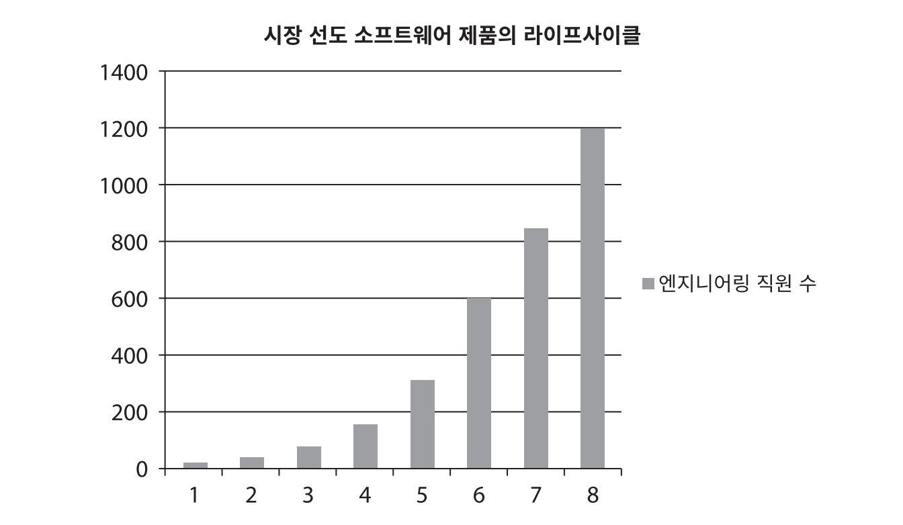
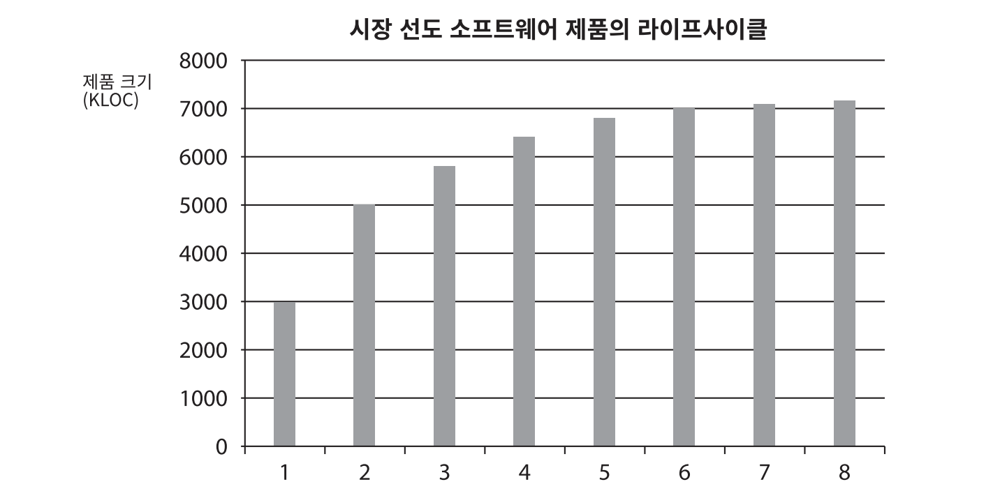
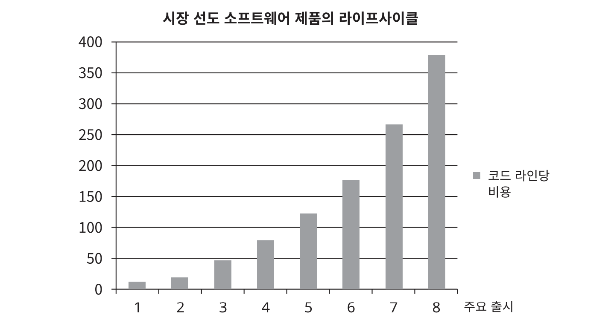
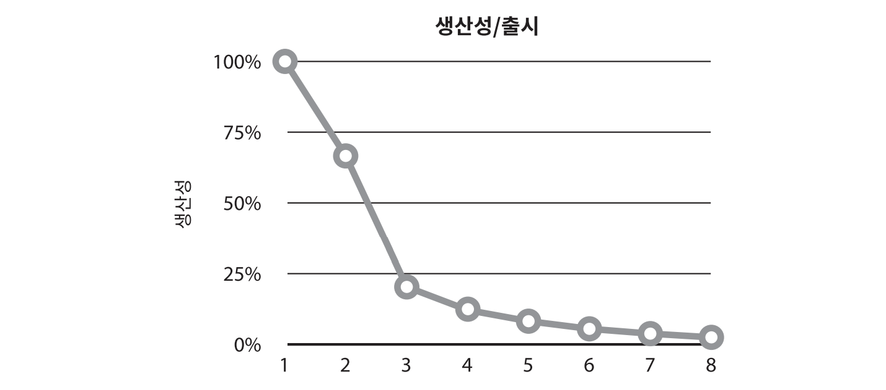
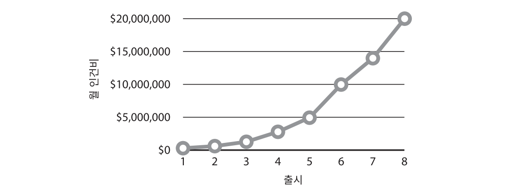

이 책의 목적 중 하나는 **설계**와 **아키텍처** 사이의 혼란을 없애고, 설계와 아키텍처가 무엇인지 완전하게 정의하는 것이다. 먼저 결론을 말하자면 둘 사이에는 **아무런 차이가 없다.**

**'아키텍처'는 저수준의 세부사항과는 분리된 고수준의 무언가를 가리킬때 흔히 사용되는 반면, '설계'는 저수준의 구조 또는 결정사항 등을 의미할때가 많다. 하지만 아래의 예와 같이 아키텍트가 실제로 하는 일을 살펴보면 이러한 구분은 무의미 하다.**

새로운 집을 설계하는 아키텍트가 있다고 하면, 이 집은 아키텍처를 당연히 가지고 있다. 그렇다면 이 집의 아키텍처는 무엇일까? 답은 집의 형태, 외관, 입면도, 공간이나 방의 배치 등이 포함된다. 하지만 아키텍트가 만든 도면을 살펴보면 무수히 많은 **저수준의 세부사항**도 확인할 수 있다. 콘센트, 전등 스위치, 전등이 모두 어디에 위치하는지 도면을 통해 알 수 있다. 보일러는 어디에 놓이고, 온수기와 배출 펌프의 크기와 위치는 어떻게 되는지 역시 볼 수 있다. 벽, 지붕 그리고 기초 공사가 어떻게 진행될지도 상세히 확인할 수 있다. 즉, 모든 **고수준의 결정사항**을 지탱하는 모든 세부사항을 자세히 확인할 수 있다. 이와 같이 저수준의 세부사항과 고수준의 결정사항은 모두 **집의 전체 설계의 구성요소**가 된다.

소프트웨어 설계도 마찬가지이다. **저수준의 세부사항과 고수준의 구조는 모두 소프트웨어 전체 설계의 구성요소이고 이 둘은 단절 없이 이어진 직물과 같으며, 이를 통해 대상 시스템의 구조를 정의한다.** 개별로는 존재할 수 없고, 실제로 이 둘을 구분 짓는 경계는 뚜렷하지 않다. 고수준에서 저수준으로 향하는 의사결정의 연속성만이 있을 뿐이다.

## Table of Contents

- [목표는?](#목표는)
- [사례 연구](#사례-연구)
- [엉망진창이 되어 가는 신호](#엉망진창이-되어-가는-신호)
- [경영자의 시각](#경영자의-시각)
- [무엇이 잘못되었나?](#무엇이-잘못되었나)
- [결론](#결론)

## 목표는?

그렇다면 좋은 소프트웨어 설계의 목표는 무엇일까? 로버트 C. 마틴은 다음과 같이 설명한다.

> 소프트웨어 아키텍처의 목표는 필요한 시스템을 만들고 유지보수하는 데 투입되는 인력을 최소화하는 데 있다.

**설계 품질을 재는 척도는 고객의 요구를 만족시키는 데 드는 비용을 재는 척도와 다름없다.** 이 비용이 낮을 뿐만 아니라 시스템의 수명이 다할 때까지 낮게 유지할 수 있다면 **좋은 설계**라고 말할 수 있다. 새로운 기능을 출시할 때마다 **비용이 증가한다면 나쁜 설계**다.

## 사례 연구

다음 사례는 익명으로 남길 원하는 실제 회사의 진짜 데이터이다. 먼저 그림 1.1에서 엔지니어링 직원 수가 늘어나는 추세를 살펴보면 긍정적인 상황으로 여길 것이다.

<small>그림 1.1 엔지니어링 직원 수의 증가 추이</small>

이제 같은 기간동안 회사의 생산성을 본다. 생산성은 단순히 코드 라인 수로만 측정한다.

<small>그림 1.2 동일한 기간의 생산성</small>

무언가 잘못됐다. 매번 새로운 기능을 출시할 때마다 개발자의 수는 지속적으로 증가했지만, 코드 생산성은 마치 한 곳으로 수렴하는 것처럼 보인다. 다음 그림 1.3은 같은 기간에 코드 한 라인당 비용이 어떻게 변했는지를 보여준다.

<small>그림 1.3 동일한 기간의 코드 라인당 비용</small>

이러한 방향으로는 지금 당장의 수익은 낼지 몰라도 결국 회사의 성장을 멈추게 하거나 완전히 망하게 만든다. 이처럼 생산성을 현저하게 변화시킨 요인은 대체 무엇인가? 여덟 번째 출시한 제품의 코드는 처음 제품보다 왜 40배나 더 많은 비용이 드는가?

## 엉망진창이 되어 가는 신호

시스템을 급하게 만들거나, 결과물의 총량을 순전히 프로그래머 수만으로 결정하거나, 코드와 설계의 구조를 깔끔하게 만들려는 생각을 전혀 하지 않으면 그림 1.4와 같은 비용 곡선을 띈다.

<small>그림 1.4 출시별 생산성</small>

위 그림은 개발자의 생산성을 거의 100%로 시작했지만, 출시할 때마다 하락하며 결국에는 0으로 되는 모습을 나타낸다. 개발자 입장에서 보면 이러한 현상은 큰 절망감을 안겨준다. 모두가 전력을 기울여 열심히 일하고 있기 때문이다. 하지만 이러한 노력에도 불구하고 더이상 발전이 없는 상황에 처하게 된다. 개발자의 노력은 기능 개발보다는 엉망이 된 상황에 대처하는 데 소모되며 결국엔 개발자들이 쏟은 노력의 가치가 결국 보잘것없게 된다.

## 경영자의 시각

이러한 상황이 나쁘게 보인다면 경영자 입장에서 살펴보자. 그림 1.5는 같은 기간에 개발하는 데 쓰인 월별 인건비를 보여준다.

첫 번쨰 출시에서는 매월 수십만 달러의 인건비만으로 제품을 생산한 반면 두 번째 출시에서는 수십만 달러가 더 들었고 점점 인건비가 증가하는 모습이다. 그림 1.5의 곡선과 그림 1.2의 출시별 코드 라인 수를 비교해 보면 초기 출시에는 매월 수십만 달러의 비용으로 많은 기능을 탑재할 수 있엇지만 마지막 출시에서는 2천만 달러를 들이고도 얻은게 거의 없다.

## 무엇이 잘못되었나?

많은 개발자들은 **"코드는 나중에 정리하면 돼. 당장은 시장에 출시하는게 먼저야!"**라는 거짓말에 속으며 실제로 **나중에 코드를 정리하는 경우**는 없는데, 시장의 압박은 절대로 줄어들지 않기 때문이다. '시장 출시가 먼저'라고 생각하는 이유는 많은 경쟁자가 있고, 그들보다 앞서 나가기 위해서이며 이로인해 코드를 정리할 시간이 없다.

개발자가 속는 더 잘못된 거짓말은 **"지저분한 코드를 작성하면 단기간에는 빠르게 갈 수 있고, 장기적으로 볼 때만 생산성이 낮아진다**는 견해다. 하지만 진실을 말하자면 다음과 같다. **엉망으로 만들면 깔끔하게 유지할 때보다 항상 더 느리다.**

> 빨리 가는 유일한 방법은 제대로 가는 것이다.

## 결론

어떤 경우에도 개발 조직이 할 수 있는 최고의 선택지는 **조직에 스며든 과신을 인지하여 방지하고, 소프트웨어 아키텍처의 품질을 심각하게 고민하기 시작하는 것이다.**

이를 위해 좋은 소프트웨어 아키턱처가 무엇인지 이해해야 한다. 비용은 최소화하고 생산성은 최대화 할 수 있는 설계와 아키텍처를 가진 시스템을 만들려면, 이러한 결과로 이끌어줄 시스템 아키텍처가 지닌 속성을 알고 있어야 한다.

## References

- 모든 이미지의 출처는 **Clean Architecture 도서**에 있습니다.
