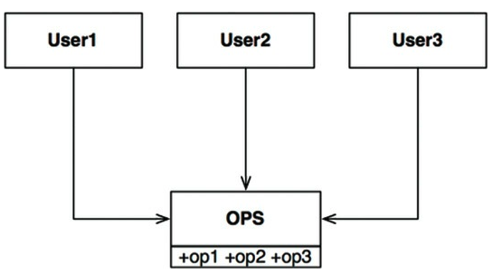
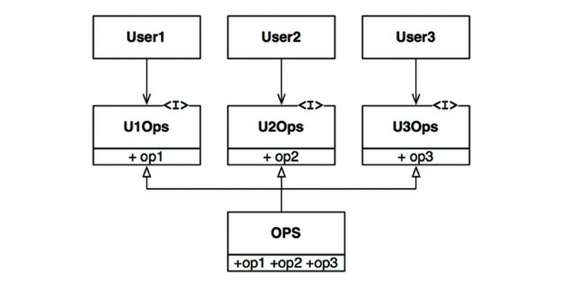

인터페이스 분리 원칙(ISP)은 아래 다이어그램에서 이름이 유래했다.

<small>그림 10.1 인터페이스 분리 원칙</small>

User1: op1, User2: op2, User3: op3 만 사용한다고 가정한다면

- User1의 소스 코드는 op2, op3을 사용하지 않음에도 의존한다.
- OPS 클래스에서 op2의 소스 코드가 변경되면 User1도 컴파일 후 배포해야 한다.

이러한 문제는 아래 그림처럼 오퍼레이션을 **인터페이스 단위로 분리**하여 해결할 수 있다.

<small>그림 10.2 분리된 오퍼레이션</small>

## Table of Contents

- [ISP와 언어](#isp와-언어)
- [ISP와 아키텍처](#isp와-아키텍처)
- [결론](#결론)

## ISP와 언어

- 언어 타입(정적, 동적 등)에 따라 소스 코드 의존성 여부가 다르다.
- 따라서, ISP를 아키텍처가 아니라, 언어와 관련된 문제라고 결론내릴 여지가 있다.

## ISP와 아키텍처

- 필요 이상으로 많은 걸 포함하는 모듈에 의존하는 것은 해로운 일이다.
- 불필요한 재컴파일과 재배포를 강제하기 때문이다.

아키텍처 수준에서도 마찬가지 상황이 발생한다.

## 결론

> 10장에서 배울 수 있는 교훈

**_불필요한 짐을 실은 무언가에 의존하면 예상치도 못한 문제에 빠진다._**

## References

- 모든 출처는 **Clean Architecture 도서**에 있습니다.
