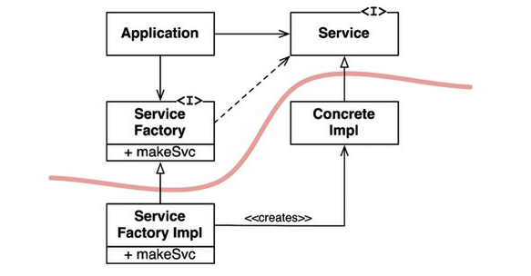

의존성 역전 원칙(DIP)에서 말하는, **유연성이 극대화된 시스템**이란,

- 소스 코드 의존성이 추상(abstraction)에 의존하며 구체(concretion)에는 의존하지 않는 시스템이다.

우리가 의존하지 않도록 피하고자 하는 것은 바로 **변동성이 큰(volatile)** 구체적인 요소다.

- 이 구체적인 요소는 우리가 열심히 개발하는 중이라 자주 변경될 수 박에 없는 모듈들이다.

## Table of Contents

- [안정된 추상화](#안정된-추상화)
- [팩토리](#팩토리)
- [구체 컴포넌트](#구체-컴포넌트)
- [결론](#결론)

## 안정된 추상화

- 추상 인터페이스에 변경이 생기면 이를 구체화한 구현체들도 따라서 수정해야 한다.
- 반대로 구체적인 구현체에 변경이 생기더라고 그 구현체가 구현하는 인터페이스는 대다수의 경우 변경될 필요가 없다.
- 즉, **_인터페이스는 구현체보다 변동성이 낮다._**

아래는 의존성 역전 원칙(DIP)에서 전달하려는 코딩 실천법의 요약이다.

1. **변동성이 큰 구체 클래스를 참조하지 말라.**

- 대신 추상 인터페이스를 참조하라.
- 추상 팩토리(Abstract Factory)를 사용하도록 강제한다.

2. **변동성이 큰 구체 클래스로부터 파생하지 말라.**

- 정적 타입 언어에서 상속은 소스 코드에 존재하는 모든 관계 중에서 가장 강력한 동시에 뻣뻣해서 변경하기 어렵다.
- 따라서 상속은 아주 신중하게 사용해야한다.

3. **구체 함수를 오버라이드 하지 말라.**

- 대체로 구체 함수는 소스 코드 의존성을 필요로 한다.
- 오버라이드 하면 의존성을 상속하게 된다.
- 의존성을 제거하려면, 추상 함수로 선언하고 구현체들에서 각자의 용도에 맞게 구현해야 한다.

4. **구체적이며 변동성이 크다면 절대로 그 이름을 언급하지 말라.**

- 이 실천법은 DIP 원칙을 다른 방식으로 풀어쓴 것이다.

## 팩토리

아래 그림은 추상 팩토리를 사용한 구조이다.

<small>그림 11.1 의존성을 관리하기 위해 추상 팩토리(Abstract Factory) 패턴을 사용한다.</small>

- `Application`은 `Service` 인터페이스를 통해 `ConcreteImpl`을 사용하지만, `Application`에서는 어떤 식으로든 `ConcreteImpl`의 인스턴스를 생성해야 한다.
- `ConcreteImpl`에 대해 소스 코드 의존성을 만들지 않으면서 이 목적을 이루기 위해 `Application`은 `ServiceFactory` 인터페이스의 `makeSvc` 메서드를 호출한다.
- 이 메서드는 `ServiceFactory`로부터 파생된 `ServiceFactoryImpl`에서 구현된다.
- 그리고 `ServiceFactoryImpl` 구현체가 `ConcreteImpl`의 인스턴스를 생성한 후 `Service` 타입으로 반환한다.

그림 11.1의 곡선은 **아키텍처 경계**를 뜻한다.

- 이 곡선은 구체적인 것들로 부터 추상적인 것들을 분리한다.
- 소스 코드 의존성은 해당 곡선과 교차할 때 모두 한 방향, 즉 **추상적인 쪽**으로 향한다.
- 곡선은 시스템을 **추상 컴포넌트**, **구체 컴포넌트**로 분리한다.
  - 추상 컴포넌트는 애플리케이션의 모든 **고수준 업무 규칙**을 포함한다.
  - 구체 컴포넌트는 업무 규칙을 다루기 위해 필요한 모든 **세부사항**을 포함한다.
- 즉, **_소스 코드 의존성은 제어흐름과는 반대 방향으로 역전된다. → 의존성 역전(Dependency Inversion)_**

## 구체 컴포넌트

구체 컴포넌트에 구체적인 의존성이 없어야 하지만, **DIP 위배를 모두 없앨 수는 없다.** 이는 일반적인 일이다.

- 이러한 구체 컴포넌트를 최소한 하나는 포함할 것인데, 이를 **메인(Main)**이라고 부른다.

## 결론

DIP는 아키텍처 다이어그램에서 가장 눈에 드러나는 원칙이 될것이다.

- 의존성은 아키텍처 경계를 기준으로, 더 **추상적**인 엔티티가 있는 쪽으로만 향한다.
- 이 규칙을 **의존성 규칙(Dependency Rule)**이라 부른다.

## References

- 모든 출처는 **Clean Architecture 도서**에 있습니다.
