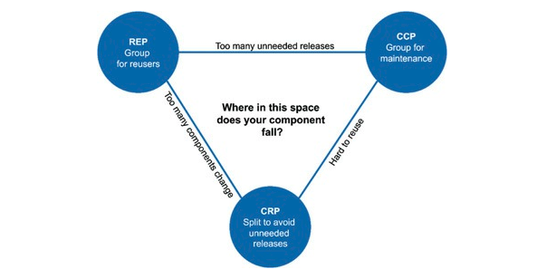

어떤 클래스를 어느 컴포넌트에 포함시켜야 할까?

컴포넌트 응집도와 관련된 세 가지 원칙이다.

- REP: 재사용/릴리스 등가 원칙(Reuse/Release Equivalence Principle)
- CCP: 공통 폐쇄 원칙(Common Closure Principle)
- CRP: 공통 재사용 원칙(Common Reuse Principle)

## Table of Contents

- [REP: 재사용/릴리스 등가 원칙](#rep-재사용릴리스-등가-원칙)
- [CCP: 공통 폐쇄 원칙](#ccp-공통-폐쇄-원칙)
  - [SRP와의 유사성](#srp와의-유사성)
- [CRP: 공통 재사용 원칙](#crp-공통-재사용-원칙)
  - [ISP와의 관계](#isp와의-관계)
- [컴포넌트 응집도에 대한 균형 다이어그램](#컴포넌트-응집도에-대한-균형-다이어그램)
- [결론](#결론)

## REP: 재사용/릴리스 등가 원칙

> 재사용 단위는 릴리스 단위와 같다

- 소프트웨어 설계와 아키텍처 관점에서 보면 단일 컴포넌트는 **응집성 높은 클래스와 모듈들로 구성**되어야 함을 의미한다.
- 컴포넌트를 구성하는 모든 모듈은 서로 공유하는 중요한 테마나 목적이 있어야 한다.
- 하나의 컴포넌트로 묶인 클래스와 모듈은 버전 번호가 같고, 동일한 릴리스로 추적 관리되고, 동일한 릴리스 문서에 포함되어야 한다는 사실은 이치에 맞다.
- REP 원칙을 어기면 '이치에 맞지'않게 된다.

## CCP: 공통 폐쇄 원칙

> 동일한 이유로 동일한 시점에 변경되는 클래스를 같은 컴포넌트로 묶어라. 서로 다른 시점에 다른 이유로 변경되는 클래스는 다른 컴포넌트로 분리하라.

- 이 원칙은 단일 책임 원칙(SRP)을 컴포넌트 관점에서 다시 쓴 것이다.
- SRP에서 단일 클래스(class)는 변경의 이유가 여러 개 있어서는 안 된다고 말하듯, 공통 폐쇄 원칙(CCP)에서도 마찬가지로 단일 컴포넌트(component)는 **변경의 이유가 여러 개 있어서는 안된다**고 말한다.
- 대다수의 애플리케이션에서 유지보수성(maintainability)은 재사용성보다 훨씬 중요하다.
- CCP는 변경될 가능성이 있는 클래스는 모두 한곳으로 묶을 것을 권한다.

### SRP와의 유사성

- CCP는 컴포넌트 수준의 SRP다.
  - SRP → 서로 다른 이유로 변경되는 메서드를 서로 다른 클래스로 분리하라
  - CCP → 서로 다른 이유로 변경되는 클래스를 서로 다른 컴포넌트로 분리하라

두 원칙은 다음과 같이 요약할 수 있다.

> 동일한 시점에 동일한 이유로 변경되는 것들을 한데 묶어라. 서로 다른 시점에 다른 이유로 변경되는 것들은 서로 분리하라.

## CRP: 공통 재사용 원칙

> 컴포넌트 사용자들을 필요하지 않는 것에 의존하게 강요하지 말라.

- 같이 재사용되는 경향이 있는 클래스와 모듈들은 같은 컴포넌트에 포함해야 한다고 말한다.
- 어떤 컴포넌트가 다른 컴포넌트를 사용하면, 두 컴포넌트 사이에는 의존성이 생긴다.
- 의존하는 컴포넌트가 있다면 해당 컴포넌트의 모든 클래스에 대해 의존함을 확실히 인지해야 한다.
- CRP는 강하게 결합되지 않은 클래스들을 동일한 컴포넌트에 위치시켜서는 안 된다고 말한다.
- CRP는 어떤 클래스를 한곳에 묶어도 **되는지**보다는, 어떤 클래스를 한곳에 묶어서는 **안 되는지**에 대해서 훨씬 더 많은 것을 이야기한다.

### ISP와의 관계

- CRP는 인터페이스 분리 원칙(ISP)의 포괄적인 버전이다.
- ISP → 사용하지 않는 메서드가 있는 클래스에 의존하지 말라고 조언
- CRP → 사용하지 않는 클래스를 가진 컴포넌트에 의존하지 말라고 조언
- 이 두 조언은 아래 한 문장으로 요약 할 수 있다.
  > 필요하지 않은 것에 의존하지 말라.

## 컴포넌트 응집도에 대한 균형 다이어그램

- 응집도에 관한 세 원칙은 서로 상충된다..
- `REP`와 `CCP`는 **포함(inclusive)** 원칙이다. → 컴포넌트를 더욱 크게 만듦
- `CRP`는 **배제(exclusive)** 원칙이다. → 컴포넌트를 더욱 작게 만듦

그림 13.1은 균형(tension) 다이어그램으로, 응집도에 관한 세 원칙이 서로 어떻게 상호작용하는지 보여준다.

- 다이어그램의 각 변(edge은 반대쪽 꼭지점에 있는 원칙을 포기했을때 감수해야 할 비용을 나타낸다.

<small>그림 13.1 결합도 원칙들의 균형 다이어그램</small>

- 프로젝트의 컴포넌트 구조는 시간과 성숙도에 따라 변한다.
- 프로젝트가 실제로 수행하는 일 자체보다는 프로젝트가 발전되고 사용되는 방법과 더 관련이 깊다.

## 결론

어느 클래스들을 묶어서 컴포넌트로 만들지를 결정할 때, **재사용성과 개발가능성**이라는 상충하는 힘을 반드시 고려해야 한다. 이들 사이에서 애플리케이션의 요구에 맞게 균형을 잡는 일은 중요하다.

- 이 균형점은 거의 항상 유동적이다.
- 즉, 두 힘을 현재 상황에 맞게 잘 분배했더라도, 내년이 되면 맞지 않을 수 있다.
- 결과적으로 시간이 흐름에 따라 프로젝트의 초점이 개발 가능성에서 재사용성으로 바뀌고, 그에 따라 컴포넌트를 구성하는 방식도 조금씩 흐트러지고 또 진화한다.

## References

- 모든 출처는 **Clean Architecture 도서**에 있습니다.
