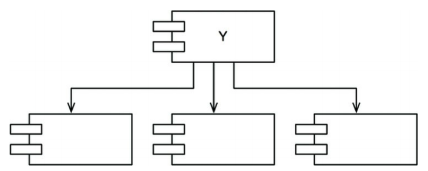
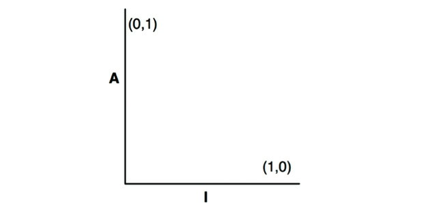

아래서 나올 세 가지 원칙은 컴포넌트 사이의 관계를 설명한다.

## Table of Contents

- [ADP: 의존성 비순환 원칙](#adp-의존성-비순환-원칙)
  - [주 단위 빌드(Weekly Build)](#주-단위-빌드weekly-build)
  - [순환 의존성 제거하기](#순환-의존성-제거하기)
  - [순환이 컴포넌트 의존성 그래프에 미치는 영향](#순환이-컴포넌트-의존성-그래프에-미치는-영향)
  - [순환 끊기](#순환-끊기)
  - [흐트러짐(Jitters)](#흐트러짐jitters)
- [하향식(top-down) 설계](#하향식top-down-설계)
- [SDP: 안정된 의존성 원칙](#sdp-안정된-의존성-원칙)

  - [안정성](#안정성)
  - [안정성 지표](#안정성-지표)
  - [모든 컴포넌트가 안정적이어야 하는 것은 아니다](#모든-컴포넌트가-안정적이어야-하는-것은-아니다)
    ➣ [추상 컴포넌트](#추상-컴포넌트)

- [SAP: 안정된 추상화 원칙](#sap-안정된-추상화-원칙)
  - [고수준 정책을 어디에 위치시켜야 하는가?](#고수준-정책을-어디에-위치시켜야-하는가)
  - [안정된 추상화 원칙](#안정된-추상화-원칙)
  - [추상화 정도 측정하기](#추상화-정도-측정하기)
  - [주계열](#주계열)
    ➣ [고통의 구역](#고통의-구역)
    ➣ [쓸모없는 구역](#쓸모없는-구역)
  - [배제 구역 벗어나기](#배제-구역-벗어나기)
  - [주계열과의 거리](#주계열과의-거리)
- [결론](#결론)

## ADP: 의존성 비순환 원칙

> 컴포넌트 의존성 그래프에 순환(cycle)이 있어서는 안 된다.

동일한 소스코드를 여러 사람이 수정하다 보면 서로의 코드에 의존성이 생긴다. 만약 A가 작성한 코드가 B에 의존해서 작동하고 있다고 치자. 이때 누군가 B 코드를 수정하게 된다면 A가 작성한 코드는 작동하지 않을 것 이다.

이 문제의 해결책으로 다음 두 가지 방법이 있다.

- 주 단위 빌드(weekly build)
- 의존성 비순환 원칙(Acyclic Dependencies Principle, ADP)

### 주 단위 빌드(Weekly Build)

- 중간 규모의 프로젝트에서 흔히 사용
- 일주일의 첫 4일을 각자 코딩하고 금요일에 통합 및 빌드를 몰아서 한다.
- 장점
  - 빠른 피드백
  - 고립되어 편안하게 개발 가능
- 단점
  - 프로젝트가 커지면 통합하는데 오래 걸림
  - 통합에 드는 시간이 늘어나면 팀의 효율성이 나빠짐

### 순환 의존성 제거하기

주 단위 빌드의 문제의 해결책은 **개발 환경을 릴리스 가능한 컴포넌드 단위로 분리**하는 것이다.

- 이 같은 작업 절차가 성공적으로 동작하려면 컴포넌트 사이의 의존성 구조를 반드시 관리해야 한다.
- 의존성 구조에 **순환이 있어서는 안된다.**

다음 그림은 컴포넌트를 조립하여 애플리케이션을 만드는 전형적인 구조이다.

<small>그림 14.1 전형적인 컴포넌트 다이어그램</small>

- 이 구조는 방향 그래프(directed graph)이다.
- 컴포넌트는 정점(vertext)에 해당하고, 의존성 관계는 방향이 있는 간선(directed edge)에 해당한다.
- 어느 컴포넌트에서 시작하든, 의존성 관계를 따라가면서 최초의 컴포넌트로 돌아갈 수 없다.
- 이 구조는 순환이 없다. 즉, 비순환 방향 그래프(Directed Acyclic Graph, DAG)다.
- 시스템 전체를 릴리스해야 하면 상향식으로 진행된다.
  - Entities(컴파일, 테스트, 릴리스) → Database, Interators, → ...
- 컴포넌트 구성요소 간 의존성을 파악하고 있으면 **_시스템을 빌드하는 방법과 순서_**를 알 수 있다.

### 순환이 컴포넌트 의존성 그래프에 미치는 영향

새로운 요구사항이 발생해 `Entities`에 포함된 클래스 하나가 `Authorizer`에 포함된 클래스 하나를 사용하도록 변경할 수 밖에 없다고 가정하자.

아래 그림처럼 순환 의존성(dependency cycle)이 발생한다.

<small>그림 14.2 순환 의존성</small>

- `Database` 컴포넌트를 만드는 개발자는 컴포넌트를 릴리스 하려면 `Entities` 컴포넌트와 반드시 호환되어야 한다.
- 하지만 `Entities` 컴포넌트에는 순환이 있으므로 `Database` 컴포넌트는 `Authorizer`와도 호환되어야 한다.
- 이렇게 순환을 하면서 사실상 하나의 거대한 컴포넌트가 되어 버린다.
- 의존성 그래프에 순환이 생기면 컴포넌트를 분리하기가 상당히 어려워진다.
- 단위 테스트를 하고 릴리스를 하는 일도 굉장히 어려워지며, 에러도 쉽게 발생한다.
- 모듈의 개수가 많아짐에 따라 빌드 관련 이슈는 기하급수적으로 증가한다.

### 순환 끊기

컴포넌트 사이의 순환을 끊고 의존성을 다시 DAG(비순환 방향 그래프)로 원상복구하는 일은 언제라도 가능하다.

다음은 두가지 원리이다.

1. 의존성 역전(DIP)을 적용한다.  
   아래 그림처럼 User가 필요로 하는 메서드를 제공하는 인터페이스를 생성한다. 그리고 이 인터페이스는 `Entities`에 위치시키고, `Authorizer`에서는 이 인터페이스를 상속받는다.

<small>그림 14.3 Entities와 Authorizer 사이의 의존성을 역전시킨다.</small>

2. `Entities`와 `Authorizer`가 모두 의존하는 새로운 컴포넌트를 만든다. 그리고 두 컴포넌트가 모두 의존하는 클래스들을 새로운 컴포넌트로 이동시킨다.

<small>그림 14.4 Entities와 Authorizer 모두 의존하는 새로운 컴포넌트</small>

### 흐트러짐(Jitters)

**순환 끊기**의 두 번째 해결책에서 시사하는 바는 요구사항이 변경되면 컴포넌트 구조도 변경될 수 있다는 사실이다. 순환이 발생하면 어떤 식으로든 끊어야 한다.

- 이 말은 **때로는 새로운 컴포넌트를 생성하거나 의존성 구조가 더 커질 수도 있음을 의미한다.**

## 하향식(top-down) 설계

- 컴포넌트 구조는 하향식으로 설계될 수 없다.
  - 컴포넌트는 시스템에서 가장 먼저 설계할 수 있는 대상이 아니다.
- 컴포넌트 의존성 다이어그램은 애플리케이션의 기능을 의미하지는 않는다.
- 오히려 애플리케이션의 빌드 가능성(buuildability)과 유지보수성(maintainability)을 보여주는 지도(map)와 같다.
  - 빌드, 유지보수할 소프트웨어가 없다면 지도 또한 필요 없으므로 프로젝트 초기에 설계할 수 없다.
- 의존성 구조와 관련된 최우선 관심사는 **변동성**을 격리하는 일이다.
- 아키텍트는 컴포넌트 의존성 그래프를 자주 변경되는 컴포넌트로부터 안정적으로 만든다.
- 아무런 클래스도 설계하지 않은 상태에서 컴포넌트 의존성 구조를 설계하려고 하면 실패를 할 것이다.
  - 컴포넌트 의존성 구조는 시스템의 논리적 설계에 발맞춰 성장하며 또 진화해야 한다.

## SDP: 안정된 의존성 원칙

> 안정성의 방향으로(더 안정된 쪽에) 의존하라.

- 변동성을 지니도록 설계한 컴포넌트는 언젠가 변경되리라고 **예상한다.**
- 변경이 쉽지 않은 컴포넌트가 변동이 예상되는 컴포넌트에 의존하게 만들어서는 절대 안된다.
  - 한번 의존하게 되면 변동성이 큰 컴포넌트도 결국 변경이 어려워진다.
- **안정된 의존성 원칙(Stable Dependencies Principe, SDP)**을 준수하면 변경하기 어려운 모듈이 변경하기 쉽게 만들어진 모듈에 의존하지 않도록 만들 수 있다.

### 안정성

'안정성(stability)'이란 무슨 뜻일까?

무언가가 안정적이라는 말을 웹스터(Webster) 사전에서는 '쉽게 움직이지 않는'이라고 정의한다. 안정성은 **변경을 만들기 위해 필요한 작업량**과 관련된다. 옆면으로 선 동전이 안정적이지 않은 이유는 그다지 힘을 쓰지 않고도 넘어뜨릴 수 있기 때문이다. 반면 탁자는 상당히 안정적인데, 탁자를 뒤집으려면 상당한 수고를 감수해야 하기 때문이다.

- 소프트웨어 컴포넌트를 변경하기 어렵게 만드는 확실한 방법 하나는 **수많은 컴포넌트가 해당 컴포넌트에 의존하게 만드는 것이다.**

<small>그림 14.5 X는 안정된 컴포넌트다.</small>

- 위 그림은 안정된 컴포넌트다.
- 세 컴포넌트가 X에 의존하고, 따라서 X 컴포넌트는 변경하지 말아야 할 이유가 세 가지나 있기 때문이다.
- 이 경우 X는 세 컴포넌트를 책임진다(responsible)라고 말한다.
- 반대로 X는 어디에도 의존하지 않으므로 X가 변경되도록 만들 수 있는 외적인 영향이 전혀 없다. 이 경우 X는 독립적이다(independent)라고 말한다.

<small>그림 14.6 Y는 상당히 불안정한 컴포넌트다.</small>

- 위 그림에서 Y는 상당히 불안정한 컴포넌트다.
- 어떤 컴포넌트도 Y에 의존하지 않기 때문에 Y는 책임성이 없다고 말할 수 있다.
- 또한 Y는 세 개의 컴포넌트에 의존하므로 변경이 발생할 수 있는 외부 요인이 세 가지다.
- 이 경우 Y는 의존적이라고 말한다.

### 안정성 지표

어떻게 하면 컴포넌트 안정성을 측정할 수 있을까?

컴포넌트로 들어오고 나가는 의존성의 개수를 세어 보는 방법이 있을 수 있다.

- **_Fan-in_**: 안으로 들어오는 의존성. 이 지표는 컴포넌트 내부의 클래스에 의존하는 컴포넌트 외부의 클래스 개수를 나타낸다.
- **_Fan-out_**: 바깥으로 나가는 의존성. 이 지표는 컴포넌트 외부의 클래스에 의존하는 컴포넌트 내부의 클래스 개수를 나타낸다.
- **_I(불안정성)_**: I = Fan-out / (Fan-in + Fan-out). 이 지표는 [0, 1] 범위의 값을 갖는다. I = 0 이면 최고로 안정된 컴포넌트라는 뜻이다. I = 1 이면 최고로 불안정한 컴포넌트라는 뜻이다.

<small>그림 14.7 예제</small>

`Cc` 컴포넌트의 안정성을 계산해보자.

- `Cc` 내부의 클래스에 의존하며 `Cc` 외부에 있는 클래스는 세 개다. `Fan-in = 3`
- `Cc` 내부의 클래스가 의존하는 `Cc` 외부에 위치한 클래스는 한 개다. `Fan-out = 1`, `I = 1/4`

SDP(안정된 의존성 원칙)에서 컴포넌트의 **_I_** 지표는 그 컴포넌트가 의존하는 다른 컴포넌트들의 **_I_** 보다 커야 한다고 말한다.

**_즉, 의존성 방향으로 갈수록 I 지표 값이 감소해야 한다._**

### 모든 컴포넌트가 안정적이어야 하는 것은 아니다

모든 컴포넌트가 최고로 안정적인 시스템이라면 **변경이 불가능하다.** 이는 바람직한 상황이 아니고 우리가 컴포넌트 구조를 설계할 때 기대하는 것은 **불안정한 컴포넌트도 있고 안정된 컴포넌트도 존재하는 상태**다.

다음은 세 컴포넌트로 구성된 시스템이 가질 수 있는 이상적인 구조의 다이어그램이다.

<small>그림 14.8 세 컴포넌트로 구성된 시스템의 이상적인 구성</small>

- 위쪽에 변경 가능한 컴포넌트가 있고, 아래의 안정된 컴포넌트에 의존한다.
- 다이어그램에서 불안정한 컴포넌트를 관례적으로 위쪽에 둔다.(따르면 유용)
- 위로 향하는 화살표가 있으면 SDP를 위배하는(ADP도 위반하는) 상태가 되기 때문이다.

#### 추상 컴포넌트

오로지 인터페이스만을 포함하는 컴포넌트를 생성하는 방식인 추상 컴포넌트는 상당히 안정적이며, 따라서 덜 안정적인 컴포넌트가 의존할 수 있는 이상적인 대상이다.

- 동적 타입 언어(루비, 파이썬 등)같은 언어를 사용할 때는 이러한 추상 컴포넌트가 전혀 존재하지 않을 뿐만 아니라, 추상 컴포넌트로 향하는 의존성 같은 것도 전혀 없다.
- 이들 언어에서 의존성 구조는 훨씬 단순한데, 의존성을 역전시킬 때 인터페이스를 선언하거나 상속받는 일이 전혀 필요하지 않기 때문이다.

## SAP: 안정된 추상화 원칙

> 컴포넌트는 안정된 정도만큼만 추상화되어야 한다.

### 고수준 정책을 어디에 위치시켜야 하는가?

시스템에는 자주 변경해서는 절대로 안되는 소프트웨어도 있다. **고수준 아키텍처나 정책 결정과 관련된 소프트웨어가 그 예다.** 따라서 시스템에서 고수준 정책을 캡슐화하는 소프트웨어는 반드시 안정된 컴포넌트(I = 0)에 위치해야 한다.

하지만 고수준 정책을 안정된 컴포넌트에 위치시키면, 그 정책을 포함하는 소스 코드는 수정하기가 어려워진다. 이로 인해 시스템 전체 아키텍처가 유연성을 잃는다.

그렇다면 어떻게 컴포넌트가 최고로 안정된 상태이면서도(I = 0) 동시에 변경에 충분히 대응할 수 있을 정도로 유연하게 만들 수 있을까?

해답은 **개방 폐쐐 원칙(OCP)**에서 찾을 수 있다.

### 안정된 추상화 원칙

안정된 추상화 원칙(Stable Abstractions Principle, SAP)은 안정성(stability)과 추상화 정도(abstractness) 사이의 관계를 정의한다.

- 안정된 컴포넌트는 **추상 컴포넌트**여야 하며, 안정성이 컴포넌트를 확장하는 일을 방해해서는 안 된다고 말한다.
- 불안정한 컴포넌트는 반드시 **구체 컴포넌트**여야 하며, 불안정하므로 컴포넌트 내부의 구체적인 코드를 쉽게 변경할 수 있어야 하기 때문이다.
- SAP와 SDP를 결합하면 컴포넌트에 대한 DIP나 마찬가지가 된다.
  - 실제로 SDP에서는 의존성이 반드시 안정성의 방향으로 향해야 한다고 말하고
  - SDP에서는 안정성이 결국 추상화를 의미한다고 말하기 때문이다.
  - 따라서 **의존성은 추상화의 방향으로 향하게 된다.**

핵심은, **_안정적인 컴포넌트라면 반드시 인터페이스와 추상 클래스로 구성되어 쉽게 확장할 수 있어야 한다._**

### 추상화 정도 측정하기

다음은 컴포넌트의 클래스 총 수 대비 인터페이스와 추상 클래스의 개수를 단순히 계산한 값이다.

- **_NC_**: 컴포넌트의 클래스 개수
- **_Na_**: 컴포넌트의 추상 클래스와 인터페이스의 개수
- **_A_**: 추상화 정도. `A = Na / Nc`(A가 0이면 추상 클래스가 한개도 없고, 1이면 오로지 추상 클래스만 있음)

### 주계열

아래 그림은 안정성(I)과 추상화 정도(A) 사이의 관계 그래프다.

- 최고로 안정적이며 추상화된 컴포넌트는 (0, 1)에 위치한다.
- 최고로 불안정하며 구체화된 컴포넌트는 (1, 0)에 위치한다.

<small>그림 14.12 A/I 그래프</small>

- 모든 컴포넌트가 이 두 지점에 위치하는 것은 아니다.

아래 그림의 궤적은 컴포넌트가 절대로 위치해서는 안 되는 영역, 배제할 구역(Zone of Exclusion)이다.

<small>그림 14.13 배제 구역(Zone of Exclusion)</small>

#### 고통의 구역

(0, 0) 주변 구역에 위치한 컴포넌트는 매우 안정적이며 구체적이다. 뻣뻣한 상태이다. 추상적이지 않아서 확장할 수 없고, 안정적이므로 변경하기 상당히 어렵다.

하지만 변동성이 없는 컴포넌트는 (0, 0) 구역에 위치하더라고 해롭지 않다. 변동될 가능성이 없기 때문이다.

#### 쓸모없는 구역

(1, 1) 주변의 컴포넌트는 최고로 추상적이지만, 누구도 그 컴포넌트에 의존하지 않는다. 이러한 컴포넌트는 쓸모가 없다. 따라서 이 구역은 쓸모없는 구역(Zone of Uselessness)이라고 부른다.

### 배제 구역 벗어나기

- 변동성이 큰 컴포넌트 대부분은 두 배제 구역으로부터 가능한 한 멀리 떨어뜨려야 한다.
- 최대한 멀리 떨어진 점의 궤적은 (1, 0)과 (0, 1)을 잇는 선분이다. → 저자는 주계열(Main Sequence)이라고 부름
- 주계열 위 또는 가깝게 위치해야 하며, 이렇게 위치하면 **'너무 추상적'**이지도 않고, 추상화 정도에 비해 **'너무 불안정'**하지도 않다.

### 주계열과의 거리

지표를 통해 주 계열에서 멀리 벗어난 컴포넌트의 원인을 파악하고 조사하는 것이 중요하다.

## 결론

**의존성 관리 지표**는 설계의 의존성과 추상화 정도가 저자가 '훌륭한' 패턴이라고 생각하는 수준에 얼마나 잘 부합하는지를 측정한다.

- 저자는 경험을 통해 좋은 의존성도 있지만 좋지 않은 의존성도 있다는 사실을 배웠다고 한다.
- '훌륭한' 패턴은 이러한 경험을 반영한다.

## References

- 모든 출처는 **Clean Architecture 도서**에 있습니다.
