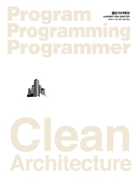

소프트웨어 시스템이란 정책을 기술한 것이다. 실제로 컴퓨터 프로그램의 핵심부는 이게 전부다.

컴퓨터 프로그램은 각 입력을 출력으로 변환하는 정책을 상세하게 기술한 설명서다.

대다수의 주요 시스템에서 하나의 정책은 이 정책을 서술하는 여러 개의 조그만 정책들로 쪼갤 수 있다.

- 집계와 관련된 업무 규칙을 처리하는 방식을 서술하는 조그만 정책
- 특정 보고서를 어떤 포맷으로 만들지를 서술하는 정책
- 입력 데이터를 어떻게 검증할지를 서술하는 정책

의존성은 소스 코드, 컴파일 타임의 의존성이다.

- 자바 → `import` 구문
- C# → `using` 구문
- 루비 → `require` 구문

## Table of Contents

- [수준](#수준)
- [결론](#결론)

## 수준

'수준(level)'을 엄밀하게 정의하면 **'입력과 출력까지의 거리'**다.

- 시스템의 입력과 출력 모두로부터 멀리 위치할수록 정책의 수준은 높아진다.
- 입력과 출력을 다루는 정책이라면 시스템에서 최하위 수준에 위치한다.

소스 코드 의존성은 그 수준에 따라 결합되어야 하며, **데이터 흐름을 기준으로 결합되서는 안 된다.**

- 데이터 흐름과 소스 코드 의존성이 항상 같은 방향을 가리키진 않음

다음은 잘못된 아키텍처가 적용된 암호화 프로그램을 작성했을때 예이다.

```js
function encrypt() {
  while (true) {
    writeChar(translate(readChar()));
  }
}
```

- 고수준인 `encrypt` 함수가 저수준인 `readChar`와 `writeChart` 함수에 의존하기 때문에 잘못된 아키텍처이다.

## 결론

정책에 대한 논의는 아래 원칙을 모두 포함한다.

- 단일 책임 원칙
- 개방 폐쇄 원칙
- 공통 폐쇄 원칙
- 의존성 역전 원칙
- 안정된 의존성 원칙
- 안정된 추상화 원칙

이 원칙들의 설명을 다시 읽어 보고 각 원칙이 어디에서 무슨 이유로 사용되었는지를 잘 숙지하자.

## References

- 모든 출처는 **Clean Architecture 도서**에 있습니다.
