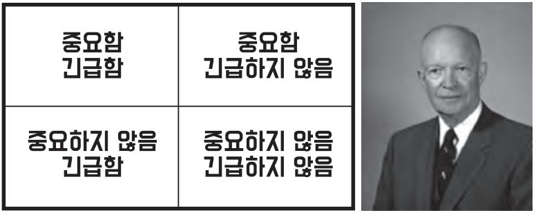

모든 소프트웨어 시스템은 이해관계자에게 서로 다른 두 가지 가치인 **행동(behavior)**와 **구조(structure)**를 제공한다. 대부분 소프트웨어 개발자는 둘 중 덜 중요한 가치에 집중하며 결국에는 소프트웨어 시스템이 쓸모없게 된다.

## Table of Contents

- [행위](#행위)
- [아키텍처](#아키텍처)
- [더 높은 가치](#더-높은-가치)
- [아이젠하워 매트릭스](#아이젠하워-매트릭스)
- [아키텍처를 위해 투쟁하라](#아키텍처를-위해-투쟁하라)

## 행위

소프트웨어의 첫 번째 가치는 바로 **행위(behavior)**다. 프로그래머는 이해관계자가 기능 명세서나 요구사항 문서를 구체화할 수 있도록 돕는다. 그리고 기계가 이 요구사항을 만족하도록 프로그래머는 코드를 작성한다. 만약 기계가 요구사항을 위반해 에러가 발생하면, 프로그래머는 디버거를 열어 문제를 해결한다.

많은 프로그래머가 이러한 활동이 자신이 해야 할 일의 전부라고 생각한다. 안타깝게도 이는 틀렸다.

## 아키텍처

소프트웨어의 두 번째 가치는 **'소프트웨어(software)'**라는 단어와 관련이 있다. '소프트웨어라'는 단어는 '부드러운(soft)'과 '제품(ware)'의 합성어 인데 **'부드러운(soft)'** 이란 단어에 두 번째 가치가 존재한다.

소프트웨어는 반드시 **'부드러워'**야 한다. 다시 말해 **변경하기 쉬워**야 한다. 이해 관계자가 기능을 변경하면 프로그래머는 간단하고 쉽게 적용할 수 있어야 한다.

소프트웨어 개발 비용의 증가를 결정짓는 주된 요인은 바로 이 **변경사항의 범위와 형태의 차이**에 있다. 이러한 문제는 시스템의 아키텍처 때문이다. 아키텍처가 특정 형태를 다른 형태보다 선호하면 할수록, 새로운 기능을 이 구조에 맞추는게 더 힘들어진다. 따라서 **아키텍처는 독립적인 형태**이어야 하고, 그럴수록 더 실용적이다.

## 더 높은 가치

- 기능 vs 아키텍처
- 둘 중 어느 것의 가치가 더 높은가?
- 소프트웨어 시스템이 동작하도록 만드는 것이 더 중요한가?
- 아니면 소프트웨어 시스템을 더 쉽게 변경할 수 있도록 하는 것이 더 중요한가?

대다수의 개발자와 업무관리자는 위 질문에 이렇게 답할 것이다.

 

**_"소프트웨어 시스템이 동작하는 것이 더 중요하다."_**

 

하지만 로버트 C. 마틴은 이를 **잘못된 태도**라고 말한다. 아래는 이 주장의 근거이다.

- 완벽하게 동작하지만 수정이 아예 불가능한 프로그램을 내게 준다면, 이 프로그램은 요구사항이 변경될 때 동작하지 않게 되고, 결국 프로그램이 돌아가도록 만들 수 없게 된다. 따라서 이러한 프로그램은 거의 쓸모가 없다.
- 동작은 하지 않지만 변경이 쉬운 프로그램을 내게 준다면, 나는 프로그램이 돌아가도록 만들 수 있고, 변경사항이 발생하더라도 여전히 동작하도록 유지보수할 수 있다. 따라서 이러한 프로그램은 앞으로도 계속 유용한채로 남는다.

물론 이러한 주장이 설득력이 떨어진다고 느낄 수 있다. 변경이 완전히 불가능한 프로그램은 존재하지 않기 때문이다. 하지만 **변경에 드는 비용이 변경으로 창출되는 수익을 초과한다면 수정이 현실적으로 불가능한 시스템은 존재**한다.

## 아이젠하워 매트릭스

드와이트 D. 아이젠하워(Dwight D. Eisenhower) 미국 대통령이 고안한 중요성과 긴급성에 관한 아이젠하워 매트릭스를 살펴보자(그림 2.1).

<small>그림 2.1 아이젠하워 매트릭스</small>

여기서 엄청 중요한 사실이 담겨 있다. **긴급한 문제**가 **아주 중요한 문제**일 경우는 드믈고, **중요한 문제**가 **몹시 긴급한** 경우는 거의 없다.

소프트웨어의 첫 번째 가치인 **행위**는 긴급하지만 매번 높은 중요도를 가지는 것은 아니다.  
소프트웨어의 두 번째 가치인 **아키텍처**는 중요하지만 즉각적인 긴급성을 필요로 하는 경우는 절대 없다.

이 네가지 경우에 우선순위를 매겨보면 다음과 같다.

1. 긴급하고 중요한
2. 긴급하지는 않지만 중요한
3. 긴급하지만 중요하지 않은
4. 긴급하지도 중요하지도 않은

아키텍처, 즉 중요한 일은 가장 높은 두 순위를 차지하고, 행위는 첫 번째와 세번째에 위차한다는 점을 주목하자.

## 아키텍처를 위해 투쟁하라

> 소프트웨어 개발자인 당신도 이해관계자임을 명심하라.

개발자인 우리도 소프트웨어를 안전하게 보호해야 할 책임이 있다.

아키텍처가 후순위가 되면 시스템을 개발하는 비용이 더 많이 들고, 일부 또는 전체 시스템에 변경을 가하는 일이 현실적으로 불가능해진다. 이러한 상황이 발생하도록 용납했다면, 이는 결국 소프트웨어 개발팀이 스스로 옳다고 믿는 가치를 위해 충분히 투쟁하지 않았다는 뜻이다.

## References

- 모든 출처는 **Clean Architecture 도서**에 있습니다.
