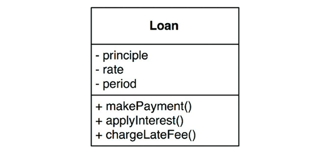
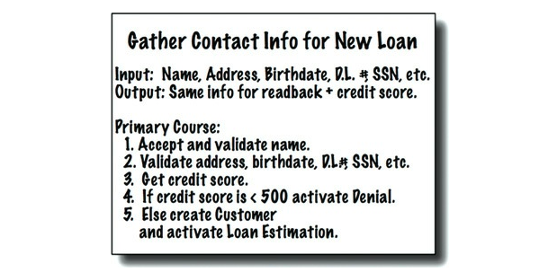

엄밀히 말하면 업무 규칙은 사업적으로 수익을 얻거나 비용을 줄일 수 있는 규칙 또는 절차다.

- ex) 대출에 N%의 이자를 부과한다는 사실은 은행이 돈을 버는 업무 규칙이다.
- 직원이 직접 계산하든 프로그램이 계산하든 관계가 없음
- 이러한 규칙을 **핵심 업무 규칙(Critical Business Rule)**이라고 부른다.
  - 사업 자체에 핵심

핵심 업무 규칙은 보통 데이터를 요구한다.

- ex) 대출에는 대출 잔액, 이자율, 지급 일정이 필요하다.
- 이러한 데이터를 **핵심 업무 데이터(Critical Business Data)**라고 부른다.

핵심 규칙과 핵심 데이터는 본질적으로 결합되어 있기 때문에 객체로 만들 좋은 후보가 된다.

- 이러한 유형의 객체를 **엔티티(Entity)**라고 부른다.

## Table of Contents

- [엔티티](#엔티티)
- [유스케이스](#유스케이스)
- [요청 및 응답 모델](#요청-및-응답-모델)
- [결론](#결론)

## 엔티티

- 컴퓨터 시스템 내부의 객체로서, 핵심 업무 데이터를 기반으로 동작하는 일련의 조그만 핵심 업무 규칙을 구체화 한다.

다음 그림은 대출을 뜻하는 Loan 엔티티를 UML 클래스로 나타낸 것이다.

<small>그림 20.1 UML 클래스로 표현한 Loan 엔티티</small>

- 세 가지의 핵심 업무 데이터를 포함
- 데이터와 관련된 세 가지 핵심 업무 규칙을 인터페이스로 제공함

엔티티를 만들때 유일한 요구조건은 핵심 업무 데이터와 핵심 업무 규칙을 하나로 묶어서 별도의 소프트웨어 모듈로 만들어야 한다는 것이다.

- 꼭 객체 지향 언어를 사용할 필요 없음

## 유스케이스

모든 업무 규칙이 엔티티처럼 순수한 것은 아니다.

- 유스케이스는 자동화된 시스템이 사용되는 방법을 설명한다.
  - 수동 환경에서 사용 불가
- 유스케이스는 사용자가 제공해야 하는 입력, 사용자에게 보여줄 출력, 그리고 해당 출력을 생성하기 위한 처리 단계를 기술한다.
- 엔티티 내의 핵심 업무 규칙과는 반대로, 유스케이스는 애플리케이션에 특화된(application-specific) 업무 규칙을 설명한다.

다음은 유스케이스의 예제다.

<small>그림 20.2 유스케이스 예제</small>

- 엔티티 내부의 핵심 업무 규칙을 어떻게, 그리고 언제 호출 할지 명시하는 규칙을 담는다.
- 사용자 인터페이스를 기술하지 않는다.
  - 유스케이스만 봐선 이 애플리케이션이 웹인지 콘솔인지 등 구분할 수 없다.
- 유스케이스는 시스템이 사용자에게 어떻게 보이는지 설명하지 않는다.
  - 애플리케이션에 특화된 규칙을 설명하며, 이를 통해 **사용자와 엔티티 사이의 상호작용**을 규정한다.

> 왜 엔티티는 고수준이고 유스케이스는 저수준일까?

- 유스케이스는 단일 애플리케이션에 특화되어 있어, 해당 시스템의 입력과 출력에 보다 가깝게 위치하기 때문
- 엔티티는 수많은 다양한 애플리케이션에서 사용될 수 있도록 일반화된 것이므로, 각 시스템의 입력이나 출력에서 더 멀리 떨어져 있음

## 요청 및 응답 모델

유스케이스는 입력 데이터를 받아서 출력 데이터를 생성한다.

- 유스케이스 클래스의 코드가 HTML이나 SQL에 대해 알게하면 안된다.
- 의존성을 제거하는 일은 매우 중요하다.
- 요청 및 응답 모델이 독립적이어야 한다.
  - 그렇지 않다면, 그 모델에 의존하는 유스케이스가 모델과 간접적으로 결합되기 때문
- 엔티티 객체를 가리키는 참조를 요청 및 응답 데이터 구조에 포함해서는 안된다.
  - 두 객체의 목적이 완전히 다름

## 결론

**업무 규칙은 소프트웨어 시스템이 존재하는 이유다.**

- 업무 규칙은 핵심적인 기능이다.
- 업무 규칙은 수익을 내고 비용을 줄이는 코드를 수반한다.

업무 규칙은 UI나 데이터베이스 같은 저수준의 관심사로 인해 오염되어서는 안되며, 원래 그대로 모습을 유지해야 한다.

- 업무 규칙을 표현하는 코드는 반드시 시스템의 심장부에 위치해야 하며, 덜 중요한 코드는 이 심장부에 플러그인 되어야 한다.
- 업무 규칙은 시스템에서 가장 독립적이며 가장 많이 재사용할 수 있는 코드여야 한다.

## References

- 모든 출처는 **Clean Architecture 도서**에 있습니다.
