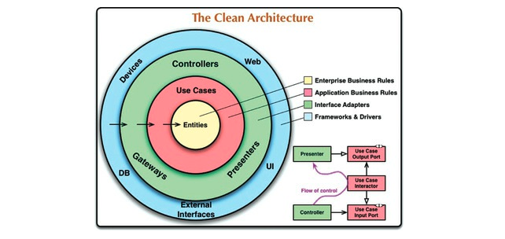
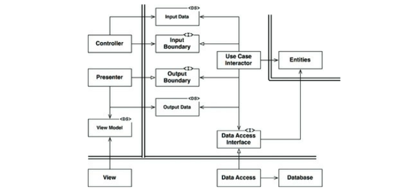

프로그래밍 세계에는 여러 아키텍처가 존재한다. 이들의 목표는 **관심사의 분리(separation of concerns)**로 모두 같다.

- 소프트웨어를 계층으로 분리한다.
- 각 아키텍처는 최소한 업무 규칙을 위한 계층 하나와, 사용자와 시스템 인터페이스를 위한 또 다른 계층 하나를 반드시 포함한다.

아키텍처들은 모두 시스템이 다음과 같은 특징을 지니도록 만든다.

1. **프레임워크 독립성**

   아키텍처는 프레임워크의 존재 여부에 의존하지 않는다. 이를 통해 프레임워크가 지닌 제약사항안으로 시스템을 욱여 넣는게 아닌 프레임워크를 도구로 사용할 수 있다.

2. **테스트 용이성**

   업무 규칙은 UI, 데이터베이스, 웹 서버, 외부 요소 없이 테스트할 수 있다.

3. **UI 독립성**

   시스템의 나머지 부분을 변경하지 않고도 UI를 쉽게 변경할 수 있다. 예를 들어 업무 규칙을 변경하지 않고도 웹 UI를 콘솔 UI로 대체할 수 있다.

4. **데이터베이스 독립성**

   오라클이나 MS SQL서버를 몽고DB(MongoDB), 빅테이블(BigTable), 카우치DB(CauchDB) 등으로 교체할 수 있다. 업무 규칙은 데이터베이스에 결합되지 않는다.

5. **모든 외부 에이전시에 대한 독립성**

   실제로 업무 규칙은 외부 세계와의 인터페이스에 대해 전혀 알지 못한다.

<small>그림 22.1 클린 아키텍처</small>

- 위 다이어그램은 아키텍처들 전부를 실행 가능한 하나의 아이디어로 통합하려는 시도다.

## Table of Contents

- [의존성 규칙](#의존성-규칙)
  - [엔티티](#엔티티)
  - [유스케이스](#유스케이스)
  - [인터페이스 어댑터](#인터페이스-어댑터)
  - [프레임워크와 드라이버](#프레임워크와-드라이버)
  - [원은 네 개여야만 하나?](#원은-네-개여야만-하나)
  - [경계 횡단하기](#경계-횡단하기)
  - [경계를 횡단하는 데이터는 어떤 모습인가](#경계를-횡단하는-데이터는-어떤-모습인가)
- [전형적인 시나리오](#전형적인-시나리오)
- [결론](#결론)

## 의존성 규칙

각 동심원은 소프트웨어에서의 서로 다른 영역을 표현한다.

- 안으로 향할수록 고수준의 소프트웨어가 된다.
- 바깥쪽 원은 메커니즘이고, 안쪽 원은 정책이다.

클린 아키텍처가 동작하도록 하는 가장 중요한 규칙은 **의존성 규칙(Dependency Rule)**이다.

> 소스 코드 의존성은 반드시 안쪽으로, 고수준의 정책을 향해야 한다.

- 내부의 원에 속한 요소는 외부의 원에 속한 어떤 것도 알지 못한다.
  - 함수, 클래스, 변수, 소프트웨어 엔티티로 명명되는 모든 것을 언급해선 안된다.
- 외부의 원에 선언된 데이터 형식도 내부의 원에서 절대로 사용해서는 안 된다.

### 엔티티

엔티티는 전사적인 핵심 업무 규칙을 캡슐화 한다. 엔티티는 메서드를 가지는 객체이거나 데이터 구조와 함수의 집합일 수도 있다. 기업의 다양한 애플리케이션에서 엔티티를 재사용할 수만 있다면, 형태는 별로 중요하지 않다.

전사적이지 않고 단순한 애플리케이션을 작성한다면 엔티티는 해당 애플리케이션의 업무 객체가 된다. 엔티티는 가장 일반적이며 고수준인 규칙을 캡슐화한다. 외부의 무언가가 변경되더라도 엔티티가 변경될 가능성은 희박하다. 예를 들어 페이지 내비게이션이나 보안과 관련된 변경이 발생하더라도 업무 객체가 영향을 받지 않는다. 운영 관점에서 특정 애플리케이션에 무언가 변경이 필요하더라도 엔티티 계층에는 절대로 영향을 주어서는 안 된다.

### 유스케이스

유스케이스 계층의 소프트웨어는 애플리케이션에 특화된 업무 규칙을 포함하며 모든 유스케이스를 캡슐화하고 구현한다. 유스케이스는 엔티티로 들어오고 나가는 데이터 흐름을 조정하며, 엔티티가 자신의 핵심 업무 규칙을 사용해서 유스케이스의 목적을 달성하도록 이끈다.

이 계층에서 발생한 변경이 엔티티에 영향을 주면 안 되며, 데이터베이스, UI, 또는 프레임워크와 같은 외부 요소에서 발생한 변경이 이 계층에 영향을 주면 안 된다. 유스케이스 계층은 이러한 관심사로부터 격리되어 있다.

하지만 운영 관점에서 애플리케이션이 변경된다면 유스케이스가 영향을 받고, 따라서 이 계층의 소프트웨어에도 영향을 줄 것이다. 유스케이스의 세부사항이 변하면 이 계층의 코드 일부는 분명 영향을 받을 것이다.

### 인터페이스 어댑터

인터페이스 어댑터(Interface Adaptor) 계층은 일련의 어댑터들로 구성된다. 어댑터는 데이터를 유스케이스와 엔티티에게 가장 편리한 형식에서 데이터베이스나 웹 같은 외부 에이전시에게 가장 편리한 형식으로 변환한다. 예를 들어, GUI의 MVC 아키텍처를 모두 포괄한다. 프레젠저(Presenter), 뷰(View), 컨틀롤러(Controller)는 모두 이 계층에 속한다. 모델은 그저 단순한 데이터 구조이며 컨트롤러에서 유스케이스로 전달되고, 다시 유스케이스에서 프레젠터와 뷰로 돌아간다.

이 원 안에 속한 어떤 코드도 데이터베이스에 대해 전혀 몰라야 한다. 만약 SQL 데이터베이스를 사용한다면 모든 SQL은 이 계층을 벗어나면 안 된다. 특히 이 계층에서도 데이터베이스를 담당하는 부분으로 제한되어야 한다.

또한 이 계층에는 데이터를 외부 서비스와 같은 외부적인 형식에서 유스케이스나 엔티티에서 사용되는 내부적은 형식으로 변환하는 또 다른 어댑터가 필요하다.

### 프레임워크와 드라이버

가장 바깥쪽 계층은 일반적으로 데이터베이스나 웹 프레임워크 같은 프레임워크나 도구들로 구성된다. 일반적으로 이 계층에는 안쪽원과 통신하기 위한 코드 외에 특별히 작성할 코드가 많지 않다.

프레임워크와 드라이버 계층은 모두 세부사항이 위치하는 곳이다. 웹은 세부사항이다. 데이터베이스 또한 마찬가지다. 이러한 것들을 외부에 위치시켜 피해를 최소화한다.

### 원은 네 개여야만 하나?

항상 원이 4개일 이유는 없다. 하지만 무슨 일이 있어어도 의존성 규칙은 적용된다. 소스 코드 의존성은 항상 안쪽을 향한다. 안쪽으로 갈수록 추상화와 정책의 수준은 높아진다. 가장 바깥쪽 원은 저수준의 구체적인 세부사항으로 구성된다. 그리고 안쪽으로 이동할수록 소프트웨어는 점점 추상화되고 더 높은 수준의 정책들을 캡슐화한다. 따라서 가장 안쪽 원은 가장 범용적이며 높은 수준을 가진다.

### 경계 횡단하기

맨 처음 다이어그램에 우측 하단에 원의 경계를 횡단하는 방법을 보여주는 예시가 있다. 이 예시는 컨트롤러와 프레젠터가 다음 계층에 있는 유스케이스와 통신하는 모습을 확인할 수 있다. 제어 흐름은 컨트롤러에서 시작해서, 유스케이스를 지난 후, 프레젠터에서 실행되면서 끝난다. 모든 의존성은 유스케이스를 향한다.

이처럼 제어흐름과 의존성의 방향이 명백히 반대여야 하는 경우, 보통 의존성 역전 원칙을 사용하여 해결한다. 예를 들어 자바 같은 언어에서는 인터페이스와 상속 관계를 적절하게 배치함으로써, 제어흐름이 경계를 가로지르는 바로 그 지점에서 소스 코드 의존성을 제어흐름과는 반대가 되도록 할 수 있다.

예를 들어 유스케이스에서 프레젠터를 호출해야 한다고 생각해 보자. 이때 직접 호출하면 의존성 규칙을 위배하므로 호출 해서는 안 된다. 따라서 유스케이스가 내부 원의 인터페이스('Use Case Output Port')를 호출하도록 하고, 외부 원의 프레젠터가 그 인터페이스를 구현하도록 한다.

아키텍처 경계를 횡단할 때 언제로다 같은 기법을 사용할 수 있다. 동적 다형성을 이용하여 소스 코드 의존성을 제어흐름과 반대로 만들 수 있고, 이를 통해 제어흐름이 어느 방향으로 흐르든 상관 없이 의존성 규칙을 준수할 수 있다.

### 경계를 횡단하는 데이터는 어떤 모습인가

경계를 가로지르는 데이터는 흔히 간단한 데이터 구조로 이루어져 있다. 기본적인 구조체나 간단한 데이터 전송 객체(data transfer object) 등 마음대로 고를 수 있다. 또는 함수를 호출할 때 간단한 인자를 사용해서 데이터를 전달할 수도 있다. 또, 데이터를 해시맵으로 묶거나 객체로 구성할 수도 있다. 중요한 점은 격리되어 있는 간단한 데이터 구조가 경계를 가로질러 전달된다는 사실이다.

예를 들어 많은 데이터베이스 프레임워크는 쿼리에 대한 응답으로 사용하기 편리한 데이터 포맷을 사용한다. 이러한 포맷은 '행(row) 구조'인 경우가 많다. 우리는 이 행 구조가 경계를 넘어 내부로 그대로 전달되면 의존성 규칙을 위배하게 되므로 원치 않다(내부의 원에서 외부 원의 무언가를 알아야 하므로).

따라서 경계를 가로질러 데이터를 전달할 때, 데이터는 항상 내부의 원에서 사용하기에 가장 편리한 형태를 가져야만 한다.

## 전형적인 시나리오

다음 다이어그램은 데이터베이스를 사용하는 웹 기반 자바 시스템의 전형적인 시나리오를 보여준다.

<small>그림 22.2 데이터베이스를 사용하는, 웹 기반 자바 시스템의 전형적인 시나리오</small>

## 결론

소프트웨어를 계층으로 분리하고 의존성 규칙을 준수하면 본질적으로 테스트하기 쉬운 시스템을 만들게 된다. 데이터베이스나 웹 프레임워크 같은 시스템의 외부 요소가 구식이 되더라도 어렵지 않게 교체할 수 있다.

## References

- 모든 출처는 **Clean Architecture 도서**에 있습니다.
