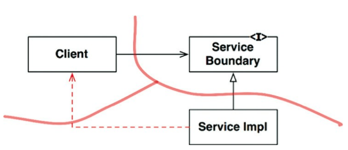
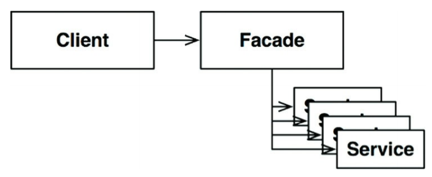

아키텍처 경계를 완벽하게 만드는 데에는 많은 비용이 든다.

- 쌍방향의 다형적 Boundary 인터페이스, Input과 Output을 위한 데이터 구조를 만들고, 두 영역을 독립적으로 컴파일 및 배포할 수 있는 컴포넌트로 격리하는데 필요한 모든 의존성을 관리해야 한다.
  - 많은 노력이 필요함

이러한 선행적 설계가 YAGNI(You Aren't Going to Need IT) 원칙을 위배한다고 한다.

- "필요한 작업만 해라"

하지만 아키텍트라면 "어쩌면 필요 할지도."라는 생각이 들 수 있다.

- 그렇다면 부분적 경계(partial boundary)를 구현해라.

## Table of Contents

- [마지막 단계를 건너뛰기](#마지막-단계를-건너뛰기)
- [일차원 경계](#일차원-경계)
- [퍼사드](#퍼사드)
- [결론](#결론)

## 마지막 단계를 건너뛰기

부분적 경계를 생성하는 방법 하나는 독립적으로 컴파일하고 배포할 수 있는 컴포넌트를 만들기 위한 작업은 모두 수행한 후, 단일 컴포넌트에 그대로 모아만 두는 것이다.

- 쌍방향 인터페이스, 입력ㆍ출력 데이터 구조, 모든 것이 완전히 준비되어 있다.
  - 하지만 이 모두를 단일 컴포넌트로 컴파일 및 배포한다.

이렇게 보면 부분적 경계를 만들때 완벽한 경계를 만들 때 만큼의 코드량과 사전 설계가 필요한것 같다.

- 하지만 다수의 컴포넌트를 관리하는 작업은 하지 않아도 된다.
- 추적을 위한 버전 번호도 없으며, 배포 관리 부담도 없다.
- 이 차이는 절대 가볍지 않다.

## 일차원 경계

완벽한 형태의 아키텍처 경계는 양방향으로 격리된 상태를 유지해야 한다.

- 쌍방향 Boundary 인터페이스 사용
- 비용 많이 듦

아래 그림은 추후 완벽한 형태의 경계로 확장할 수 있는 공간을 확보하고자 할 때 활용할 수 있는 더 간단한 구조를 나타낸다.

<small>그림 24.1 전략(Strategy) 패턴</small>

- 전통적인 전략(Strategy) 패턴을 사용한 전형적인 사례
- ServiceBoundary 인터페이스는 클라이언트가 사용하며 ServiceImpl 클래스가 구현한다.

## 퍼사드

이보다 훨씬 더 단순한 경계는 다음 그림의 퍼사드(Facade) 패턴이다.

<small>그림 24.2 퍼사드(Facade) 패턴</small>

- 이 패턴은 의존성 역전도 희생한다.
- 경계는 Facade 클래스로만 간단히 정의된다.
- Facade 클래스에는 모든 서비스 클래스를 메서드 형태로 정의하고, 서비스 호출이 발생하면 해당 서비스 클래스로 호출을 전달한다.
- 클라이언트는 서비스 클래스에 직접 접근할 수 없다.

하지만 이 경우 Client가 모든 서비스 클래스에 대해 추이 종속성을 가지게 된다.

- 정적 언어라면 서비스 클래스 중 하나라도 변경되면 Client도 무조건 재컴파일 해야 한다.
- 또한 비밀 통로(그림 24.1의 점선) 또한 쉽게 만들 수 있다.

## 결론

아키텍처 경계를 부분적으로 구현하는 간단한 방법 세 가지를 살펴 봤다(물론 더 많은 방법 존재).

- 각기 다른 나름의 비용과 장점을 지닌다.
- 각 접근법은 완벽한 형태의 경계를 담기 위한 공간으로써, 적절하게 사용할 수 있는 상황이 다르다.

## References

- 모든 출처는 **Clean Architecture 도서**에 있습니다.
