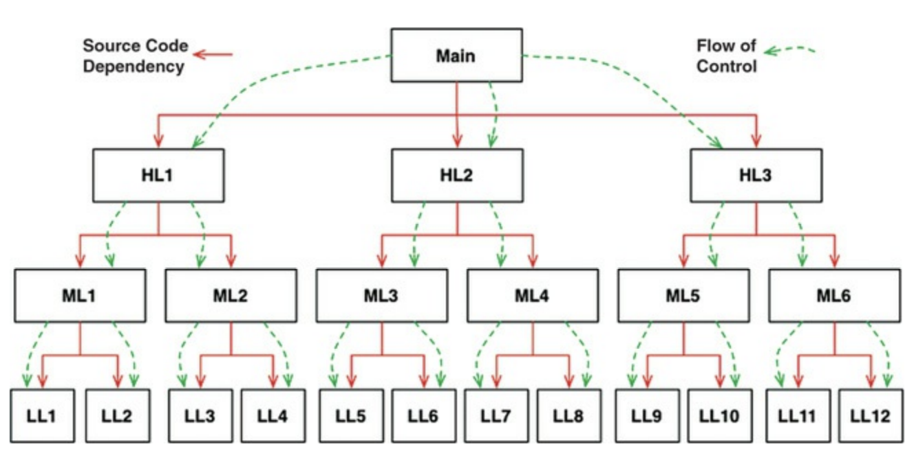
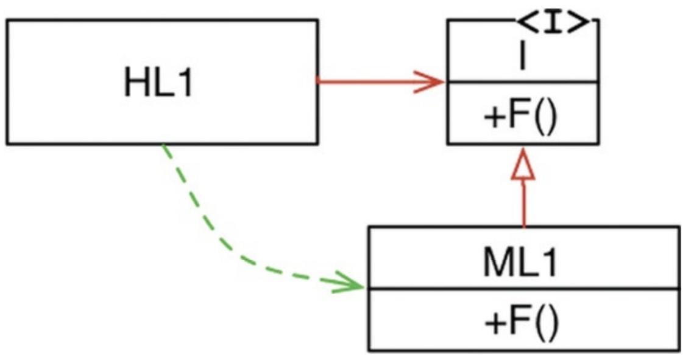
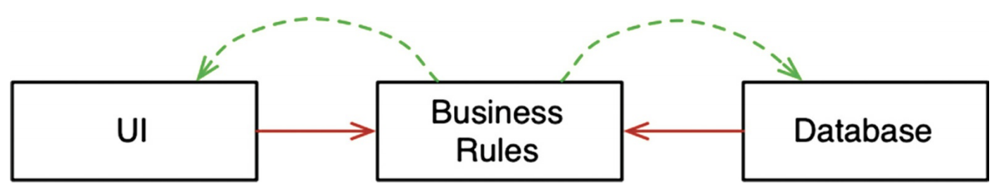

좋은 아키텍처를 만드는 것은 **객체 지향(Object-Oriented, OO) 설계 원칙**을 이해하고 응용하는데서 시작한다.

객체지향의 본질을 설명하기 위해 객체지향은 다음 세 가지 개념을 적절하게 조합하거나, 이 세 가지 요소를 반드시 지원해야 한다고 말한다.

- 캡슐화(encapsulation)
- 상속(inheritance)
- 다형성(polymorphism)

## Table of Contents

- [캡슐화?](#캡슐화)
- [상속?](#상속)
- [다형성?](#다형성)
  - [다형성이 가진 힘](#다형성이-가진-힘)
  - [의존성 역전](#의존성-역전)
- [결론](#결론)

## 캡슐화?

- 데이터와 함수를 쉽고 효과적으로 캡슐화하는 방법을 객체지향 언어가 제공한다.
- 이를 통해 데이터와 함수가 응집력 있게 구성된 집단을 서로 구분 짓는 선을 그을 수 있다.
- 구분선 바깥에서 데이터는 은닉되고, 일부 함수만이 외부에 노출된다. `private` 멤버, `public` 멤버

객체지향 프로그래밍은 프로그래머가 충분히 올바르게 행동함으로써 캡슐화된 데이터를 우회해서 사용하지 않을 것이라는 믿음을 기반으로 한다. 실제로 많은 객체지향 언어가 캡슐화를 강제하지 않는다.

## 상속?

객체지향 언어가 더 나은 캡슐화를 제공하지는 못했지만, 상속만큼은 객체지향 언어가 확실히 제공했다.

- 객체지향 언어가 고안되기 훨씬 이전에도 상속과 비슷한 기법이 사용되긴 했지만 불편했다.
- 객체지향 언어가 완전히 새로운 개념을 만들지는 못햇지만, 데이터 구조에 가면을 씌우는 일을 상당히 편리한 방식으로 제공했다.

## 다형성?

객체 지향 언어가 있기 이전에도 다형성을 표현할 수 있는 언어는 있엇다.

- 함수를 가리키는 포인터를 응용한 것이 다형성이다.
- 객체지향 언어는 다형성을 새롭게 만들어 제공하진 않지만, 다형성을 좀 더 **안전하고 더욱 편리**하게 사용할 수 있게 해준다.
- 포인터를 안전하게 사용하려면 관례를 따라야 하는데 객체지향 언어는 이러한 관례를 없애줌으로써, 실수할 위험이 없다.
- 이러한 이유로 객채지향 언어는 제어흐름을 간접적으로 전환하는 규칙을 부과한다고 결론지을 수 있다.

### 다형성이 가진 힘

- 플러그인 아키텍처(plugin architecture)는 **독립성**을 지원하기 위해 만들어졌고 적용됐다.
- 객체지향의 등장으로 언제 어디서든 플러그인 아키텍처를 적용할 수 있게 되었다.

예를 들어, 천공 카드 더미에서 입력을 받아 새로운 천콩카드 더미로 생성하는 프로그램이 있다고 하자. 추후 고객이 천공 카드 대신 자기 테이프(magnetic tape)를 사용한다면 기존 프로그램에 많은 수정이 이루어질 것이다. 이럴때 필요한 것이 플러그인 아키텍처 이다.

### 의존성 역전

다형성을 안전하고 편리하게 적용할 수 있는 메커니즘이 등장하기 전, 호출 트리에서 소프트웨어 코드의 의존성 방향은 반드시 제어흐름(flow of control)을 따랐다(그림 5.1).

<small>그림 5.1 소스 코드 의존성 vs. 제어흐름</small>

하지만 다형성이 끼어들면 특별한 일이 일어난다(그림 5.2).

<small>그림 5.2 의존성 역전</small>

위 그림은 `HL1` 모듈은 `ML1` 모듈의 `F()` 함수를 호출한다. 소스 코드에서는 HL1 모듈은 인터페이스를 통해 `F()`함수를 호출한다.

하지만 `ML1`과 `I` 인터페이스 사이의 소스 코드 의존성(상속 관계)이 제어흐름과는 반대인 점을 주목하자. 이를 **의존성 역전(dependency inversion)**이라고 한다.

- 이러한 접근법을 사용한다면, 객체지향 언어로 개발된 시스템을 다루는 소프트웨어 아키텍트는 시스템의 소스 코드 의존성 전부에 대해 방향을 결정할 수 있는 **절대적인 권한**을 갖는다.
- 이것이 바로 객체지향이 제공하는 힘이다! 그리고 이것이 객체지향이 지향하는 것이다.

그러면 이 힘으로 무엇을 할 수 있을까?

예를 들어 업무 규칙(Business rule)이 데이터베이스와 사용자 인터페이스(UI)에 의존하는 대신, 시스템의 소스 코드 의존성을 반대로 배치하여 데이터베이스와 UI가 업무 규칙에 의존하게 만들 수 있다.

<small>그림 5.3 데이터베이스와 사용자 인터페이스가 업무 규칙에 의존한다.</small>

즉, UI와 데이터베이스가 업무 규칙의 플러그인이 되고 따라서, **업무 규칙의 소스 코드에서는 UI나 데이터베이스를 호출하지 않는다.**

- 업무 규칙을 UI와 데이터베이스와는 **독립적으로 배포**할 수 있다.
  - 이것이 바로 **배포 독립성(independent deployability)**이다.
- 시스템의 모듈을 독립적으로 배포할 수 있게 되면, 서로 다른 팀에서 각 모듈을 **독립적으로 개발**할 수 있다.
  - 이것이 **개발 독립성(independent developability)**이다.

## 결론

'객체 지향이란 무엇인가?' 에 대한 소프트웨어 아키텍트 관점에서의 정답은 다음과 같다.

**객체지향이란 다형성을 이용하여 전체 시스템의 모든 소스 코드 의존성에 대한 절대적인 제어 권한을 획득할 수 있는 능력이다.**

- 객체지향을 사용하면 아키텍트는 플러그인 아키텍처를 구성할 수 있다.
- 이를 통해 고수준의 정책을 포함하는 모듈은 저수준의 세부사항을 포함하는 모듈에 대해 **독립성**을 보장할 수 있다.

## References

- 모든 출처는 **Clean Architecture 도서**에 있습니다.
