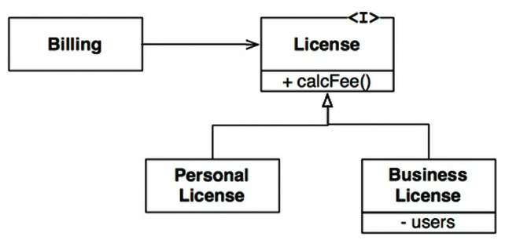
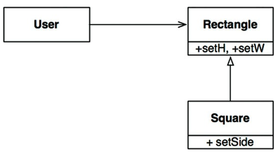

1988년 바바라 리스코프(Barbara Liskov)는 하위 타입(subtype)을 아래와 같이 정의 했다.

- S 타입의 객체 o1에 대응하는 T타입 객체 o2가 있다. → `o1: S, o2: T`
- T 타입을 이용해서 정의한 모든 프로그램 P에서 o2의 자리에 o1을 치환해도 P의 행위가 변하지 않는다면, S는 T의 하위 타입이다.

## Table of Contents

- [상속을 사용하도록 가이드하기](#상속을-사용하도록-가이드하기)
- [정사각형/직사각형 문제](#정사각형직사각형-문제)
- [LSP와 아키텍처](#lsp와-아키텍처)
- [LSP 위배 사례](#lsp-위배-사례)
- [결론](#결론)

## 상속을 사용하도록 가이드하기

<small>그림 9.1 License와 파생 클래스는 LSP를 준수한다.</small>

위 그림과 같은 설계는 LSP를 준수한다.

- Billing 애플리케이션의 행위가 License 하위 타입 중 무엇을 사용하는지에 전혀 의존하지 않기 때문이다.
- 하위 타입은 모두 License 타입을 **치환**할 수 있다.

## 정사각형/직사각형 문제

<small>그림 9.2 악명 높은 정사각형/직사각형 문제</small>

위 예제는 LSP를 위반한다.

- Square는 Rectanglge의 하위 타입으로 적합하지 않다.
  - Rectangle의 높이와 너비는 서로 독립적으로 변경될 수 있는 반면, Square의 높이와 너비는 반드시 함께 변경되기 때문이다.
- User는 사용과정에서 혼동이 생길 수 있다.
- 이를 해결하기 위해 조건문을 사용해 Rectangle이 실제로는 Square인지 검사한다.
  - 이렇게 되면 User의 행위가 사용하는 타입에 의존하게 되므로, 결국 타입을 서로 치환할 수 없게 된다.

## LSP와 아키텍처

- LSP는 인터페이스와 구현체에도 적용된다.
- 아키텍처 관점에서 LSP를 이해하는 최선의 방법은 이 원칙을 어겼을 때 시스템 아키텍처에서 무슨 일이 일어나는지 관찰하는 것이다.

## LSP 위배 사례

LSP를 위배했을때 아키텍트는 REST 서비스들의 인터페이스가 서로 치환 가능하지 않다는 사실을 처리하는 중요하고 복잡한 매커니즘을 추가해야 하는 상황도 생긴다.

## 결론

- LSP는 아키텍처 수준까지 확장할 수 있고, 반드시 확장해야만 한다.
- 치환 가능성을 조금이라도 위배하면 시스템 아키텍처가 **오염**되어 상당량의 별도 메커니즘을 추가해야 할 수 있기 때문이다.

## References

- 모든 출처는 **Clean Architecture 도서**에 있습니다.
