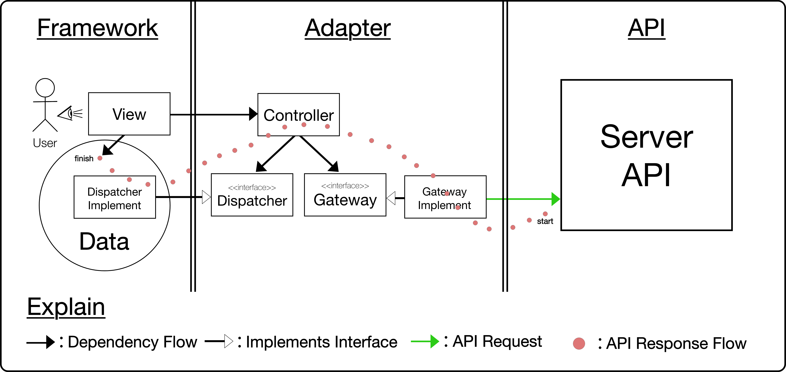
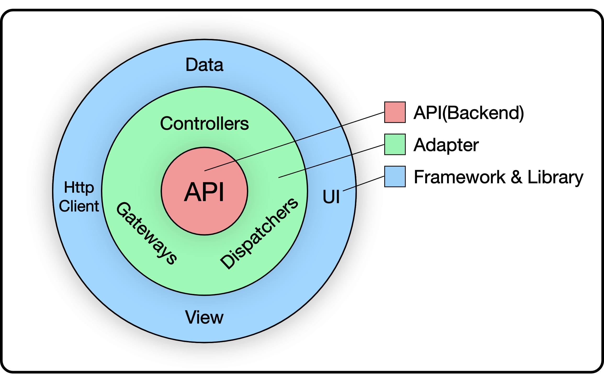

## Intro

이번 겨울방학의 목표중 하나인 클린 아키텍처 책을 정독했다.~~(뒷부분은 속독하긴 했지만)~~

해당 책에서 어떻게 코드를 작성해야 하는가 구체적인 정답을 알려주진 않았다. 따라서 나는 책을 읽으면서 느낀 지향하는 관점, 규칙 등을 토대로 이해했고 이를 바탕으로 프론트엔드에 적용해 보았다. 본 글에선 그 과정에서 느낀 점과 내가 어떻게 해석했는지 이야기해보려 한다.

프로젝트 소스코드는 [GitHub Repository](https://github.com/woochanleee/clean-architecture-for-frontend)에서 확인할 수 있다.

- [https://github.com/woochanleee/clean-architecture-for-frontend](https://github.com/woochanleee/clean-architecture-for-frontend)

## 지켜야 할 것

나는 최소한 아래 원칙들은 지키려고 했다.

1. 소프트웨어를 계층별로 관심사를 분리한다.
2. 의존성은 항상 저수준에서 고수준으로 향한다.
3. 데이터베이스나 프레임워크 UI 등 외부 요소에 의존하지 않는다.

## 내 마음대로 원 해석하기


<small>출처: https://blog.cleancoder.com/uncle-bob/2012/08/13/the-clean-architecture.html</small>

처음에 이 원을 보면서 코드를 작성했다. Entity, Use Case 등... 그러다 문득 이런 의문이 들었다.

> Uncle Bob이 웹은 세부사항이라고 그렇게 강조하던데 프론트엔드에서 비지니스 룰을 알아야 할까?

가뜩이나 Backend Frontend를 구분하는데 그러면 프론트에선 api를 요청하고 데이터를 view로 보여주기만 하면 되지 않나?

그리고 원을 다음과 같이 바꿨다.



또, 내가 생각한 프론트엔드 아키텍처를 아래와 같이 정의내렸다.

- 비지니스 룰(Backend에서 다룸)을 알 필요 없다.
- 오직 API만 신경쓰면 된다.
- `API`와 `View` 사이에 `Adapter`를 두어 서로를 연결시킨다.

그랬더니 썸네일에서 본 대략적인 시스템 흐름을 나타내는 다이어그램을 만들 수 있엇다.


이러한 각 컴포넌트가 하는 역할이 무엇인지 설명하도록 하겠다.

## Controller/Service

*어떤 용어를 쓸지는 지금도 고민중이다.*

해당 컴포넌트에서는 Dispatcher와 Gateway를 주입받아 api request를 하고 Data 저장소에 Dispatch하는 것이 목적이다.

- 도메인 별로 클래스로 나누고, 각 클래스는 관련된 api, dispatch를 이용한 메서드들의 집합으로 구성된다.

[view code](https://github.com/woochanleee/clean-architecture-for-frontend/blob/main/src/adapter/controller/UserController.ts)

[Detail](https://github.com/woochanleee/clean-architecture-for-frontend/blob/main/README.md/#controller)

## Gateway/Repository

*또한 어떤 용어를 쓸지는 지금도 고민중이다.*

해당 컴포넌트에서는 API를 요청하는 것이 목적이다.

[view code](https://github.com/woochanleee/clean-architecture-for-frontend/blob/main/src/adapter/gateway/AuthGateway.ts)

[Detail](https://github.com/woochanleee/clean-architecture-for-frontend/blob/main/README.md/#gateway)

- 각 클래스마다 client를 주입받는데 이는 Framework Layer에서 구현한다.
  - ex) axios, fetch

[view code](https://github.com/woochanleee/clean-architecture-for-frontend/blob/main/src/framework/web/react/http-client/axios.ts)

## Dispatcher

해당 컴포넌트에서는 저장소의 `get`, `set`, `remove` 등 저장소의 상태를 변화시키는 것이 목적이다.

- Framework Layer에서 사용하는 Data 저장소에서 구현된다.
  - ex) Mobx Dispatcher, Redux Dispatcher, LocalStorage Dispatcher 등

[view code](https://github.com/woochanleee/clean-architecture-for-frontend/blob/main/src/framework/web/react/view/container/redux/auth.ts#L27)

[Detail](https://github.com/woochanleee/clean-architecture-for-frontend/blob/main/README.md/#dispatcher)

## View

해당 컴포넌트는 사용자에게 보여지는 UI 부분의 집합을 의미한다.

- 사용하는 프레임워크에 맞는 구조를 사용한다.(변동 가능)
- 리액트로 치면 component, container, page, route 모두 해당된다.

내가 구성한 리액트 프로젝트는 다음과 같다. [Detail](https://github.com/woochanleee/clean-architecture-for-frontend/blob/main/README.md/#directory-structure)

```
react
  ㄴ src
    ㄴ view
      ㄴ component
      ㄴ container
      ㄴ page
      ㄴ route
    .
    .
    .
```

**1. route**
  
    page 컴포넌트만의 조합으로 이루어져 있다.
**2. page**

    component의 조합으로 이루어져 있다.
**3. container**

    hooks로 만든 store state(useAuthStore)와 dispatcher의 구현체로 이루어져 있다.
**4. component**

    원시 타입의 props만 전달 받으며 이를 가공하지 않고 그대로 렌더링 한다.

## 결론

이렇게 내가 생각한대로 아키텍처를 설계하니까 뭔가 굉장히 조촐(?)해 보인다. 하지만 아키텍처에 정답은 없다고 생각한다. 굉장히 많은 구조의 프로젝트가 존재한다. 각각 장단점도 분명 존재한다.

내가 작성한 코드 또한 마찬가지로 정답이 아닐 수 있다. 이것은 단순히 샘플 코드이며 실제로 적용해 보지 않았다. 좋은 아키텍처라면 **유지보수**가 쉬워야 하는데 이를 경험할 기회가 없었다. 또, 나처럼 클린 아키텍처를 적용한다고 노력했지만 너무 중복적이고 과도한 코드가 넘쳐나 유지보수 하는데 악영향을 끼친 사례를 들은적이 있다.

아키텍처를 고민하는건 좋다. 개발자라면 꾸준히 생각해야 할 문제다.

이러한 이유로 나는 아키텍처를 특정 구조가 정답이라고 생각하기보단 같은 구성원끼리 끊임없는 논의를 통해 얻은 아키텍처를 사용하는게 정답이라고 생각한다.