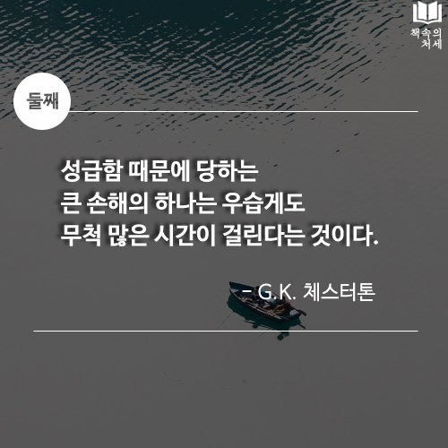

# 들어가기 전에

인터넷을 하다 인상깊은 문장을 봐서 기록해봅니다.

> one of the great disadvantages of hurry is that it takes such a long time.
성급함 때문에 당하는 큰 손해의 하나는 우습게도 무척 많은 시간이 걸린다는 것이다.

얼마전까지 취업 준비를 하면서 나는 조급했던것 같다. 위 문장을 읽고 많이 공감되었다.

이 글을 읽는 분들께서는 취업이든 다른 이유든 간에 조급해 하지 않았으면 좋겠다. 포기하지 않고 열심히 하면 뭐든 해낼 수 있다고 생각한다. 만약 시간이 없어 조급한 마음이 생겼다면 자신에게 질문을 던져보는게 어떨까?

_"내가 목적을 이루기 위해 최선을 다했나?"_

나를 포함하여 모두 포기하지 않고 이루고 싶은 목표를 이루며 행복했으면 한다.

# 회사

## 0주차(입사전)

입사 1주일 전에 회사측으로부터 온보딩 미션을 전달받았다. 간단하게 설명하자면 회사 서비스를 사용해보고 피드백을 정리해 오는 것이다.

간단한 미션이라고 볼 수 있지만 나는 이 미션을 하면서 회사에 대한 기대감이 커져갔다.

## 1주차

입사 첫 날부터 한주 동안 많은 미팅에 참여했다. 코드를 볼 시간이 없을 정도였다.

나는 이런 일정에 만족했다. 제대로된 첫 회사 생활이여서 바쁜 스케쥴때문에 지치기보단 재미있고 신났다.

남는 시간은 회사 코드를 이해하는데 사용했고 내가 기존에 하던 개발과는 다른 세상에 온것 같아 매우 흥분되었다.

FE Engineer 분들과 위클리 미팅을 진행하였는데 나는 역시나 우물 안 개구리였단 사실을 깨달았다. 다들 멋지고 존경스러웠다.

입사 초반에 바빠서였을까? 덕분에 온보딩을 빠르게 할 수 있었던것 같다.

## 2주차

2주차는 추석이 껴있엇다. 입사 1주만에 강제 휴가를 보내고 왔다.

대표님과 점심식사를 했다. 회사의 비전과 앞으로의 목표, 계획 등 회사에 대한 이야기를 들을 수 있었다. 이 시간을 통해 나는 회사에 대한 신뢰관계가 깊어졌고 좋은 프로덕트를 만들기 위해 노력하고 있다.

평소 git을 gui로 사용해서 cli가 어색했다. 지금은 많이 익숙해졌지만 몇가지 커맨드는 기억이 안나 검색하면서 하고 있다.

## 3주차

팀원분이 eslint plugin을 만들어서 공유해주었다. 나는 또 한번 감탄했고 멋있어 보였다.

PM 분과 스쿼드 온보딩을 진행했다. 내가 속한 스쿼드의 중요성을 알게되었고 회사가 어떤 성장그래프를 그리게 될 수 있을지 가능성을 봤다. 추가로 일정 관리에 대해서도 이야기를 나눴다.

내가 만드는 제품의 도메인 학습을 하는 시간을 가졌다. 팀원분이 관련 도서를 빌려주셔서 읽었다. 아직까지도 어려운것 같다. 조금씩 알아가면서 추후 전문가가 되어있길 기대한다.

typescript 삽질을 했다. 하루종일 시간을 쏟았는데 팀원분이 10분만에 해결한걸 보고 나는 많이 부족하단걸 다시한번 느꼈다.

## 4주차

순식간에 한달이 지나갔다.

FE 팀원과 여러 고민을 했다. 내가 개인적으로 공부하면서 했던 고민들을 팀원이 똑같이 했다는 사실에 놀랐고 흥미로웠다.

새 회사에서 첫 월급이 들어왔다. 첫 월급은 부모님에게 드렸다.

점심식사 후 BE 팀원과 카페에서 이야기를 나눴다. 이야기 후 나는 반성했다.

# 마치며

첫 취업을 하면서 되게 이야기하고 싶은 주제가 많았는데 이번에는 회사에서 한달동안 일을 회고해봤다. 다른 이야기들은 시간이 여유로워지면 하나씩 정리해보려 한다. 지금은 업무에 집중을 할 계획이다.

앞으로의 목표중 가장 첫번째는 회사에서 제 몫을 해내는 팀원으로 신뢰가 쌓이는 것이다.

