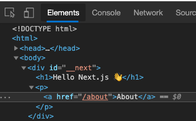
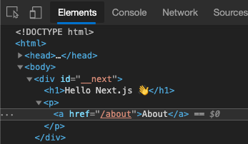
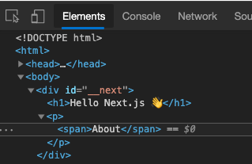
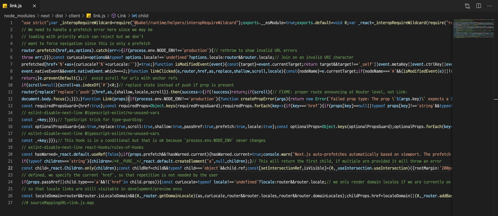
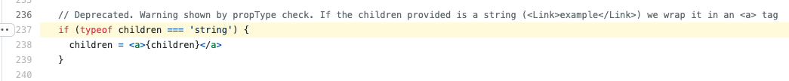

## 급하신 분을 위한 요약

`<Link to="/">Home</Link>`과 같이 Link 컴포넌트에 children으로 text만을 넘기면 Next.js가 내부적으로 a tag로 감싸서 사용한다.

## 뭐가 궁금했나?

Next.js에서 `<Link />` tag를 사용하다가 의문이 들었다. 흔히 리액트를 사용할 때 보통 아래처럼 react-router-dom의 Link 태그를 사용했었다.

```jsx
<Link to="/">Home</Link>
```

그래서 그런지 [Nextjs docs](https://nextjs.org/docs/api-reference/next/link)의 한 예제에서 왜 아래처럼 Link 태그 안에 a를 넣어주는지 이유가 있나? 라는 궁금증이 들었다.

```jsx
import Link from 'next/link';

function Home() {
  return (
    <ul>
      <li>
        <Link href="/">
          <a>Home</a>
        </Link>
      </li>
      <li>
        <Link href="/about">
          <a>About Us</a>
        </Link>
      </li>
      <li>
        <Link href="/blog/hello-world">
          <a>Blog Post</a>
        </Link>
      </li>
    </ul>
  );
}

export default Home;
```

## 궁금증 해결 과정

### 1. 구글링

이런 궁금증을 잘 못 참는 나는 당장 구글링을 시작했다. 진짜 수많은 키워드를 검색해봤다.

하지만 나는 원하는 답을 찾지 못햇다. 나의 구글링 실력 탓일지도 모르겠지만 2021.02.21 현재로썬 이 내용을 다루 글은 없는 것 같다. ~~_있다면 유감🥲_~~

그나마 나와 같은 궁금증을 가진듯한 질문을 찾긴 찾았다.

- [Why using a tag in nestjs Link?](https://stackoverflow.com/questions/63324839/why-using-a-tag-in-nextjs-link)
- [Should I use anchor tag with next/link in Next.js for SEO?](https://webmasters.stackexchange.com/questions/132795/should-i-use-anchor-tag-with-next-link-in-next-js-for-seo)

들어가보면 알 수 있듯이 SEO타령만 한다... 그래서 구글링엔 답이 안보여 2번 방법으로 넘어갔다.

### 2. 직접 노가다로 테스트 해보기

구글링으로도 답을 못찾았으니 어쩔 수 있나? 직접 테스트해보며 여러가지 특징을 도출해낼 수 밖에...

#### CASE 1:

일단 다음과 같이 Link를 사용하고 inspector를 사용해 element가 어떻게 구성되어있는지 살펴 봤다.

```jsx
<Link href="/about">
  <a>About</a>
</Link>
```

결과는 a tag안에 text



#### CASE 2:

두번째로 다음과 같이 그냥 text만 넣어봤다.

```jsx
<Link href="/about">About</Link>
```

결과는 case1이랑 똑같음



#### CASE 3:

이제 슬슬 이런 생각이 든다.

1. `Link` 태그 안에 뭘 넣든지 무조건 a태그로 변환되는 건가?
2. `Link`의 children이 text가 오면 자동으로 a tag를 만들어 주는 건가?

그래서 다음과 같이 별도의 태그를 넣어봤다.

```jsx
<Link href="/about">
  <span>About</span>
</Link>
```

결과는 다음과 같다.



a tag는 어디갔는지 사라지고 span 태그만 남았다. 하지만 클릭해보면 제 기능은 한다.

이부분은 다루지 않지만 내부적으로 Link 컴포넌트에서 onClick을 바인딩 해준다.

### 3. 라이브러리 뜯어보기

앞에서 두 가지 방법으로 나의 궁금증은 해결되지 않았다. 그래서 귀찮지만 확실한 방법인 next/link 패키지를 뜯어 보는 것이다.

먼저 가장 빠르게 vscode에서 [Code Navigation](https://code.visualstudio.com/Docs/editor/editingevolved)을 이용해 내부 코드를 열어봤다.



으악ㅋㅋ! ts(tsx) 파일이 js로 컴파일(트랜스파일?)되고 난독화까지 되어서 알아볼 수가 없었다.

- compile vs transpile에 관한 내용은 [이 블로그](https://ideveloper2.tistory.com/166)를 참고하자.

그래서 기존의 코드가 공개되어있는 [vercel/next.js github](https://github.com/vercel/next.js)에 들어갔다. 여기서도 어디에 파일이 작성되어있는지 찾기 어려울 수 있는데 vscode에서 봤을때 패키지가 저장되어 있는 경로와 비슷하다. 위에서 봤을때 `node_modules/next/dist/client/link.js`에 있으므로, 추리해보면 [next.js/link.tsx](https://github.com/vercel/next.js/blob/canary/packages/next/client/link.tsx)와 같이 찾을 수 있다.

자 이제 나의 궁금증을 해결되기까지 얼마 남지 않았다.

짜잔! [이 코드](https://github.com/vercel/next.js/blob/canary/packages/next/client/link.tsx#L237)를 보면 사진과 같이 children이 text로 넘어온 경우(i.e., type이 string) 자동으로 `<a>` 태그로 감싸서 사용하는 것이였다.



글을 작성하고 있는 2021.02.21 날짜로는 위와 같다. 새롭게 추가되었을 수도 추후 변경될 수도 있다.

## 글을 마치며

쓸데없는(?) 호기심 때문에 next 코드까지 뜯어보며 궁금증을 해결했다. 사실 이전에 nuxt를 사용하다가 이런 의문이 들어서 그때 당시 페이스북에 질문을 올렸다가 별 소득을 얻지 못하고 지냈었는데 nuxt도 내부적으로 구현되어 있었던 것 같다.

이 글을 쓰는 목적은 나중에 똑같은 생각을 하면 찾아보기 위함이고 추가로 나와 비슷하게 이런 의문을 갖는 분들이 있을까 싶어 보고 궁금증이 해결되었으면 하는 바람이다.
